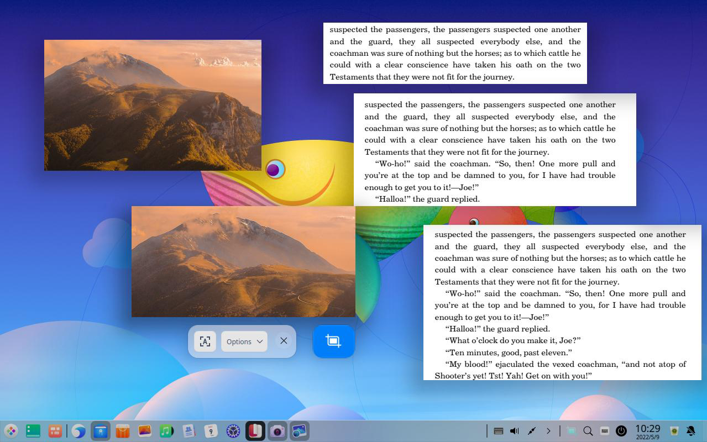
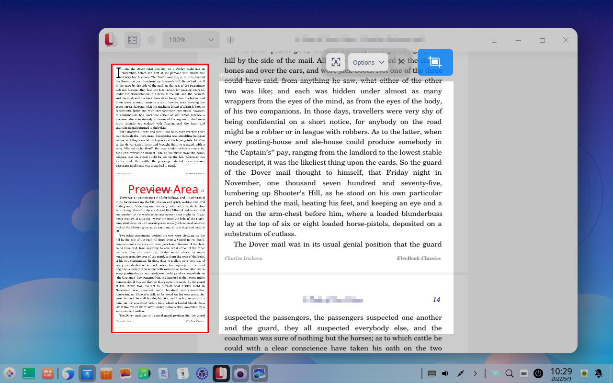

# Screen Capture|deepin-screen-recorder|

## Overview

Screen Capture is a tool which integrates the screen capture and recorder functions into one. You are free to select windows or areas automatically or manually during screen capturing or recording. 

## Guide

You can run, close, and create a desktop shortcut for Screen Capture in the following operations.

### Run Screen Capture

1. Click the Launcher icon  in the Dock to enter the launcher interface.
2. Locate Screen Capture  by scrolling the mouse wheel or searching "screen capture" in the Launcher interface and click it to run. 
3. Right-click  and you can:

    - Click **Send to desktop** to create a desktop shortcut.
    - Click **Send to dock** to fix it in the Dock.
    - Click **Add to startup** to add it to startup and it will automatically run when the system starts up.

### Close Screen Capture

- Screen Capture will exit automatically after screen capturing or screen recording completes.
- On the Screen Capture interface, click  to exit Screen Capture.
- On the Screen Capture interface, right-click and select **Save** or **Exit**.

### Shortcuts

In the Screenshot mode on the Screen Capture interface, press **Ctrl + Shift + ?** to view shortcuts. Proficiency in shortcuts will greatly improve your efficiency.

## Select and Adjust Screen Capture Area

### Select Screen Capture Area

There are three kinds of common screen capture areas, namely the full screen, program window, and customized area. When a screen capture area is captured, the selected area will be bordered with dashed white line and looks brighter than the other area.

>  Notes: When the computer is connected to multiple monitors, you can also use Screen Capture to capture areas on different monitors.

#### Select Full Screen

Full screen selection is used to identify the entire screen of the current monitor.

&nbsp;&nbsp;&nbsp;&nbsp;&nbsp;&nbsp;&nbsp;&nbsp;&nbsp;&nbsp;&nbsp;&nbsp;&nbsp;

You can select the full screen in the following ways:

1. Press **Ctrl + Alt + A** or **Ctrl + Alt + R** on the keyboard to enter the screen capture mode.
2. Move the pointer to the desktop and the full screen will be selected automatically. The screen capture dimension will be displayed in the upper left corner. 
3. Click the desktop and a toolbar will pop up.

You can also take a full screen screenshot directly in the following ways:

- If Screen Capture has been fixed in the Dock, right-click  in the Dock to select **Full creenshot**. 
- Press  on the keyboard to take a full screen screenshot.

#### Select Program Window

Program window selection is used to identify the current application window automatically.

&nbsp;&nbsp;&nbsp;&nbsp;&nbsp;&nbsp;&nbsp;&nbsp;&nbsp;&nbsp;&nbsp;&nbsp;&nbsp;

1. Press **Ctrl + Alt + A**  or  **Ctrl + Alt + R** on the keyboard to enter the screen capture mode.
2. Move the pointer to the application window and the window will be selected automatically. The screen capture dimension will be displayed in the upper left corner. 
3. Click the window and a toolbar will pop up.

#### Select Customized Area

Customized area selection is used to select the screen capture area freely by dragging the mouse.

&nbsp;&nbsp;&nbsp;&nbsp;&nbsp;&nbsp;&nbsp;&nbsp;&nbsp;&nbsp;&nbsp;&nbsp;&nbsp;

1. Press **Ctrl + Alt + A** or **Ctrl + Alt + R** on the keyboard to enter the screen capture mode.
2. Hold down and drag the left mouse button to select the screen capture area. The screen capture dimension will be displayed in the upper left corner. 
3. Release the left mouse button to complete area selection, and a toolbar will pop up.

### Adjust the Screen Capture Area

You can fine-tune the screen capture area. For example, you can enlarge or reduce the screenshot area, and move the screenshot position, among other functions. 

#### Enlarge/Reduce the Screen Capture Area

- Place the pointer over the white boarder of the screenshot area and the pointer will be changed to . Hold down the left mouse button and drag the mouse to enlarge or reduce the screenshot area. 

- Press **Ctrl** +  ,  ,  or  and drag the mouse to enlarge or reduce the screenshot area vertically or horizontally.

#### Move the Screen Capture Area Position

Place the pointer over the screen capture area and it will be changed to . You can:

- Hold down the left mouse button and drag the mouse to move the position of the screenshot area.
- Press  ,  ,  or  on the keyboard to move the screenshot area vertically or horizontally.

## Take Screenshots

Under the screenshot mode, click the corresponding icons on the toolbar and you can perform operations such as drawing and editing graphics, adding text annotations, etc. in the screenshot  area.

<table class="block1">
    <caption>Icon Description</caption>
    <tbody>
        <tr>
            <td></td>
            <td>Pin Screenshot</td>
            <td></td>
            <td>Scrollshot</td>
            <td></td>
            <td>Extract Text</td>
            </tr>
        <tr>            
            <td></td>
            <td>Rectangle</td>
            <td></td>
            <td>Elipse</td>               
            <td></td>
            <td>Line</td>
            </tr>
        <tr>
            <td></td>
            <td>Pencil</td>
            <td></td>
            <td>Text</td>
            <td></td>
            <td>Exit</td>
        </tr>
    </tbody>
</table>

>  Notes: Your settings in the toolbar and attribute column, such as the line weight and font size, are remembered and applied by default and will be resumed the next time when you launch Screen Capture. You are able to reset it as well. 

### Draw

You can draw some simple graphics in the screenshots. Click the icon on the toolbar, hold down the **Shift** key and drag the mouse to draw a square, circle and line or line with arrows horizontally and vertically.&nbsp;&nbsp;&nbsp;

#### Rectangle

&nbsp;&nbsp;&nbsp;&nbsp;&nbsp;&nbsp;&nbsp;&nbsp;&nbsp;&nbsp;&nbsp;&nbsp;&nbsp;

1. Click  on the toolbar which appears beside the screenshot area.
2. In the toolbar extension panel, select the weight and color of outline for the rectangle shape. 
3. Place the pointer on the screenshot area, and the pointer will be changed to .
4. Hold down the left mouse button, and drag the mouse to complete drawing.
5. Click  or  in the toolbar extension panel to mosaic the private information in the screenshot (if any).

&nbsp;&nbsp;&nbsp;&nbsp;&nbsp;&nbsp;&nbsp;&nbsp;&nbsp;&nbsp;&nbsp;&nbsp;&nbsp;

#### Ellipse

&nbsp;&nbsp;&nbsp;&nbsp;&nbsp;&nbsp;&nbsp;&nbsp;&nbsp;&nbsp;&nbsp;&nbsp;&nbsp;

1. Click  on the toolbar which appears beside the screenshot area.
2. In the toolbar extension panel, select the weight and color of outline for the ellipse shape. 
3. Place the pointer on the screenshot area, and the pointer will be changed to .
4. Hold down the left mouse button, and drag the mouse to complete drawing.
5. Click  or in the toolbar extension panel to mosaic the private information in the screenshot (if any).

#### Straight Line and Arrow

&nbsp;&nbsp;&nbsp;&nbsp;&nbsp;&nbsp;&nbsp;&nbsp;&nbsp;&nbsp;&nbsp;&nbsp;&nbsp;

1. Click  on the toolbar which appears beside the screenshot area.
2. In the toolbar extension panel, select the weight and color of line. 
3. Click  or  to toggle between straight line and arrow.
4. Place the pointer on the screenshot area, and the pointer will be changed to  or .
5. Hold down the left mouse button, and drag the mouse to complete drawing.

#### Pencil

&nbsp;&nbsp;&nbsp;&nbsp;&nbsp;&nbsp;&nbsp;&nbsp;&nbsp;&nbsp;&nbsp;&nbsp;&nbsp;

1. Click  on the toolbar which appears beside the screenshot area.
2. In the toolbar extension panel, select the weight and color of pencil. 
3. Place the pointer on the screenshot area, and the pointer will be changed to .
4. Hold down the left mouse button, and drag the mouse to complete drawing.

### Modify Graphics

You can modify and move the drawn graphics in the screenshot.

&nbsp;&nbsp;&nbsp;&nbsp;&nbsp;&nbsp;&nbsp;&nbsp;&nbsp;&nbsp;&nbsp;&nbsp;&nbsp;

#### Move Graphics

1. Place the pointer over the graphics outline, and the mouse will be changed to .
2. Hold down the left mouse button, and drag the graphics to any place in the screenshot area.
3. Press  ,  ,  or  on the keyboard to move the graphics vertically or horizontally.

#### Edit Graphics

1. Place the pointer over the outline of graphics and the mouse will be changed to .
2. Left-click to enter the editing mode, and you can:
   - Press the **Delete** key on the keyboard to delete the graphics.
   - Place the pointer over the edit box, and the mouse will be changed to. Enlarge or reduce the graphic area by dragging the pointer.
   - Press **Ctrl** +  ,  ,  or  to extend the graphics area vertically or horizontally.
   - Place the pointer over  in the edit box, and the pointer will be changed to . Rotate the graphics by dragging the pointer.
3. Left-click outside the edit box to exit the editing mode.

### Add Text Annotations

Add text annotations to the screenshot in order to help others better understand.

&nbsp;&nbsp;&nbsp;&nbsp;&nbsp;&nbsp;&nbsp;&nbsp;&nbsp;&nbsp;&nbsp;&nbsp;&nbsp;

1. Click  on the toolbar which appears beside the screenshot area.
2. In the toolbar extension panel, select the font color and font size via the scroll bar. 
3. Place the pointer over the screenshot, and the mouse will be changed to .
4. Click where you want to add an annotation, and a text box will appear.
5. Enter texts in the text box.

### Modify Text Annotations

You can modify and move the text annotations after they're entered.

#### Move Text Annotations

1. Place the pointer over the text, and the pointer will be changed to .
2. Hold down the left mouse button, and drag to move the text anywhere in the screenshot area.

#### Edit Text Annotations

1. Place the pointer over the text, and the pointer will be changed to .
2. Double-click to enter the text editing mode, and you can:
   - Press **Delete** on the keyboard to delete text annotations.
   - Modify the text in the text box.
3. Click outside the text box to exit editing mode.

### Pin Screenshots|pinscreenshots

With this feature, you are able to pin multiple screenshots on the system desktop for later comparison, integration, etc. conveniently.

Select the screenshot area and click the   icon on the toolbar to pin the screenshot on your desktop. You can perform the following operations:

- Move the screenshot by clicking and dragging it or pressing the , ,  or  key on the keyboard.
- Scale up or down the screenshot by placing the mouse pointer on the screenshot and scrolling up or down the mouse wheel.    
- Click the  icon on the toolbar to save it.

### Take Screen Scrollshots|scrollshot

You are able to take long screen scrollshots both in and out of the screen with the **Scrollshot** feature.

Please enable the **Window Effect** feature in **Control Center > Personalization > General** before taking screen scrollshots.

1. Select the screenshot area and click the  icon on the toolbar.
2. Place the cursor in the scrollshot area and you can start taking your scrollshots automatically, manually or alternatively.

   - Automatic scrolling: Click in the screenshot area and the cursor will scroll upwards automatically. The captured screenshots will be spliced into a complete long picture.  During the automatic scrolling process, click in the screenshot area or move the cursor out of the screenshot area to suspend the screenshot. Click in the screenshot area once again to resume.
   - Manual scrolling: Place the cursor in the screenshot area and scroll the mouse wheel upwards or downwards to take screenshot manually. Stop scrolling the mouse wheel to suspend the screenshot. Scroll it again to resume. 
3.   Click the   icon on the toolbar to save the screenshot.

>  Notes: The following conditions will lead to abnormal splicing:
>
> - The screenshot area is beyond the scrolling area, such as selecting the whole window or fullscreen; 
> - The screenshot area is too small. For example, the height is less than 50px. 
> - Multiple scrolling areas are contained in the scrolling area.
> - A great number of repetitive contents, such as blank areas, same colors or same sections of texts are contained in the scrolling area.
> - Animations, video, watermarks, etc. or contents with non-solid background are contained in the screenshot area.
> - There is a horizontal offset in the scrolling process, such as sliding the scrollbar.
> - The rolling is too fast.
> - Switch windows during the scrolling process.

### Extract Texts

You are able to recognize the texts in the screenshot area with the **Extract Text** feature.

1. Select the screenshot area and click the  icon on the toolbar to enter the text extraction area.
2. You are able to edit the recognized texts by clicking the text area in the right column. Click the  icon on the lower right corner to copy the texts recognized to the clipboard and click the  icon to save the texts recognized in TXT .

### Delay Screenshots

You are able to capture the screenshot in a specific state or at specific time with the delay screenshot feature.

- Right-click the Screen Capture icon fixed in the Dock and select **Delay Screenshot**.
- Press  **Ctrl** +  to start delay screenshot.
- Execute  “deepin-screen-recorder -d n”  in Terminal, among which n represents the delayed time in seconds.

### Save Screenshots

Save the screenshot for future use.

When the screenshot is saved successfully, you can see a prompt message in the upper area of the desktop. Click **View** to open the folder where the screenshot is located.

You can save the screenshot in the following ways after launching Screen Capture, and selecting the screenshot area:

- Double-click to save the screen capture.
- Click  on the toolbar.
- Press **Ctrl + S** on the keyboard to save the screenshot.
- Right-click the screenshot, and select **Save** to save it.

   >  Notes: The screenshot is saved to **Pictures > Screenshots** by default.

Click **Options** on the toolbar of the Screen Capture interface, and expand the drop-down list:

&nbsp;&nbsp;&nbsp;&nbsp;&nbsp;&nbsp;&nbsp;&nbsp;&nbsp;&nbsp;&nbsp;&nbsp;&nbsp;

- Select **Clipboard** to save the screenshot to the clipboard.
- Click **Desktop** and the screenshot will be saved to the desktop.
- Click **Pictures**, and the screenshot will be saved to the pictures folder.
- Click **Folder**. Select the destination folder of the screenshot, and the screenshot will be saved to your specific folder directory. 
- Select **Show pointer**, and the pointer will be displayed in the screenshot area. Its position and pattern will also be saved in the picture.
- Select **PNG/JPG/BMP** to set the screenshot format.

## Record Screen

Under the recording mode, click the icons on the toolbar and you can perform recording with audio, video, keystroke and mouse clicks. 

<table class="block1">
    <caption>Icon Description</caption>
    <tbody>
        <tr>
            <td></td>
            <td>Microphone</td>
            <td></td>
            <td>System Audio</td>
            <td></td>
            <td>Show Keystroke</td>
            <td></td>
            <td>Webcam On</td>
        </tr>
          <tr>
            <td></td>
            <td>Show Pointer</td>
            <td></td>
            <td>Show Click</td>
            <td></td>
            <td>Exit</td>
            <td></td>
            <td></td>
        </tr>
    </tbody>
</table>

>  Notes: Screen recording is not available on the SW platform.

### Set Recording Settings

On the toolbar of Screen Capture, you can set sound, keystroke, camera, etc. to get ready for video recording.

- Sound: Include microphone and built-in audio. You can select one of them or both.
- Keystroke: Click and the operation keystroke will be displayed during screen recording. Up to five recent operation keystrokes can be displayed at the same time. Click the icon again to enable **Hide Keystroke** and cancel keystroke display.
- Camera: Click to start camera. Both the camera picture and window picture are recorded during screen recording. Drag the camera window outline to adjust the window size and position. Click the icon again to disable the camera. 

   > Attention: First, check whether the device connected supports sound recording and camera functions. Otherwise you cannot perform relevant operations.

- Mouse:  Include **Show Pointer**, **Show Click** or both.
- Options: Select the **GIF**, **MP4** or **MKV** format and FPS in the Options dropdown list.

   >  Notes: GIF is not supported on the MIPS architecture devices.

### Record a Screen

You can capture the screen activities in the following ways:

1. Launch screen recorder by **Ctrl + Alt + R**.
2. Select the recording area and make relevant settings as needed.
3. Click   and recording will be started in 3 seconds with a flickering **Record** icon in the system tray.
4.  Press the **Ctrl + Alt + R** shortcuts on the keyboard, click the **Screen Capture** icon in the Dock or click the **Record** icon in the system tray to complete recording. 

The recorded video will be saved to the desktop automatically.

>  Notes: 
> - Recording time will be displayed together with the **Record** icon when the Dock is at top or bottom of the desktop.
> - During video recording, if multiple monitors are connected, whether the multi-monitor display is set in copy mode or extended mode, only the current operation screen is recorded.

## View Help

Press  on the keyboard to view the help manual after launching Screen Capture.

