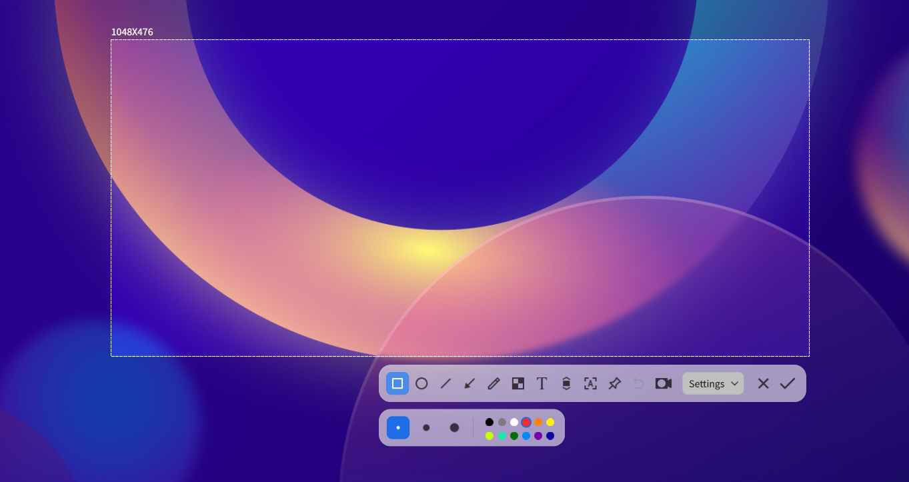
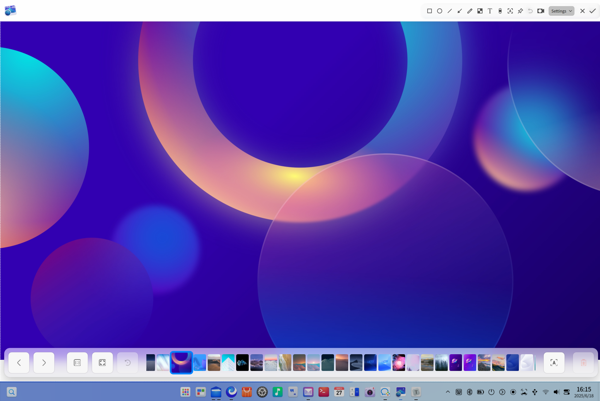
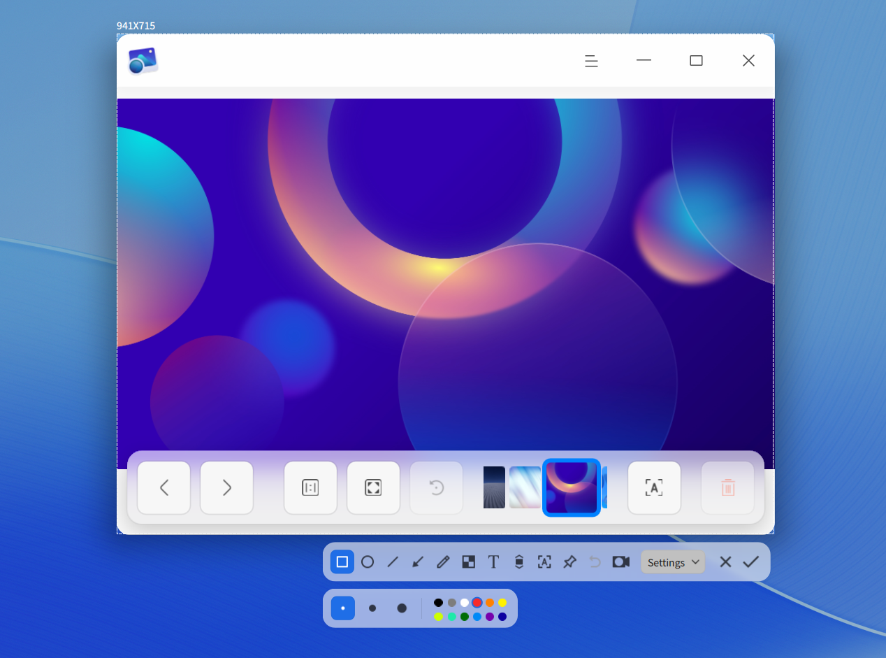
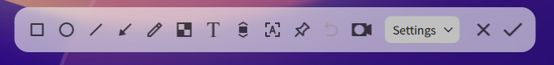
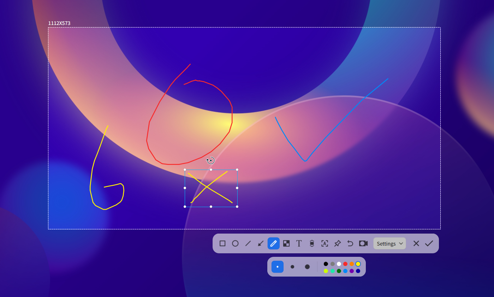
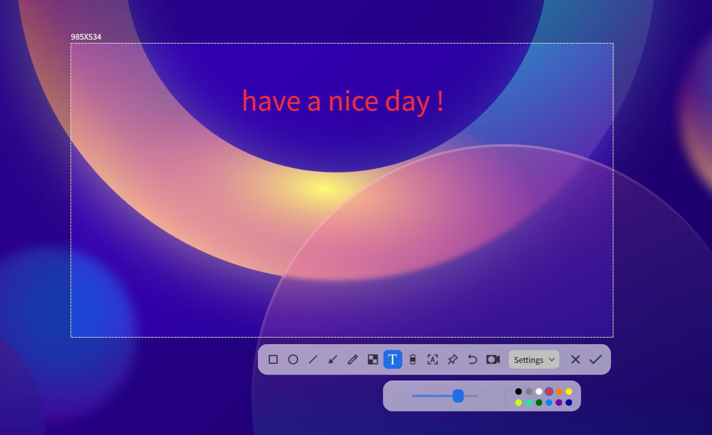
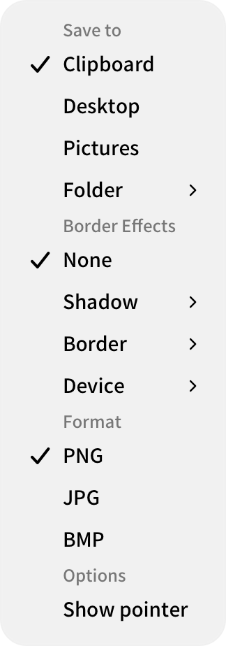

# Screenshot & Screen Recording|deepin-screen-recorder|

## Overview

Screenshot & Screen Recording is an integrated tool that combines screenshot and screen recording capabilities, supporting functions such as image editing, pin screenshots, scrolling screenshots, text recognition, and screen recording.

## Getting Started

Learn how to launch, close, and create shortcuts for Screenshot & Screen Recording.

### Launching Screenshot & Screen Recording

1. Click the Launcher icon  on the taskbar to enter the Launcher interface.
2. Scroll the mouse wheel or search to find the Screenshot & Screen Recording icon , then click to launch.
3. Right-click  to:
   - Click **Send to Desktop** to create a desktop shortcut.
   - Click **Send to Taskbar** to pin the application to the taskbar.
   - Click **Start on Boot** to add the application to startup items, so it runs automatically when the computer starts.

> Tip: In the system tray area of the taskbar, click the icon   to also launch the Screenshot & Screen Recording application.

### Closing Screenshot & Screen Recording

- Screenshot & Screen Recording automatically exits after completing a screenshot or screen recording.
- In the Screenshot & Screen Recording interface, click  to close the application.
- In screenshot mode, right-click and select **Save** or **Exit**.

### Shortcuts

Use the shortcut **Ctrl + Shift + ?** to open the shortcut preview interface. Mastering shortcuts will greatly improve your operational efficiency.

## Selecting and Adjusting Area

### Selecting Screenshot/Recording Area

Screenshot & Screen Recording supports full screen, application window, and custom area selection. When selecting an area, it will be highlighted with a white dashed border.

>  Note: When using multiple monitors, you can capture areas from different screens.

#### Full Screen
Automatically recognizes the entire screen of the current display.

&nbsp;&nbsp;&nbsp;&nbsp;&nbsp;&nbsp;&nbsp;&nbsp;&nbsp;&nbsp;&nbsp;&nbsp;&nbsp;

You can select full screen through the following steps:

1. Use the shortcut **Ctrl + Alt + A** to enter screenshot mode or **Ctrl + Alt + R** to enter screen recording mode.
2. Move the mouse pointer to the desktop. Screenshot & Screen Recording will automatically select the entire screen and display the dimensions in the top-left corner.
3. Left-click the desktop to pop up the toolbar.

You can also directly capture the full screen through:
- If pinned to taskbar: Right-click the icon  on the taskbar and select **Full Screen Screenshot**.
- Press the  key on the keyboard.

#### Window Selection
Automatically recognizes open application windows.

&nbsp;&nbsp;&nbsp;&nbsp;&nbsp;&nbsp;&nbsp;&nbsp;&nbsp;&nbsp;&nbsp;&nbsp;&nbsp;

1. Use the shortcut **Ctrl + Alt + A** to enter screenshot mode or **Ctrl + Alt + R** to enter screen recording mode.
2. Move the mouse pointer over an open application window. Screenshot & Screen Recording will automatically select the window and display the dimensions in the top-left corner.
3. Left-click the window to pop up the toolbar.

#### Custom Area
Freely select any area.

&nbsp;&nbsp;&nbsp;&nbsp;&nbsp;&nbsp;&nbsp;&nbsp;&nbsp;&nbsp;&nbsp;&nbsp;&nbsp;

1. Use the shortcut **Ctrl + Alt + A** to enter screenshot mode or **Ctrl + Alt + R** to enter screen recording mode.
2. Hold down the left mouse button and drag to select the area. The dimensions will be displayed in real-time in the top-left corner.
3. Release the left mouse button to complete area selection and pop up the toolbar.

### Adjusting Screenshot/Recording Area

You can fine-tune the selected area, such as resizing or moving the selection.

#### Enlarge/Reduce Area

- Place the mouse pointer on the white border of the area until it becomes , then hold down the left mouse button and drag to resize.
- Press **Ctrl** +  or  to expand vertically, or **Ctrl** +  or  to expand horizontally.

&nbsp;&nbsp;&nbsp;&nbsp;&nbsp;&nbsp;&nbsp;&nbsp;&nbsp;&nbsp;&nbsp;&nbsp;&nbsp;

#### Move Area Position

When the mouse pointer becomes  over the area, you can:
- Hold down the left mouse button and drag to move the area.
- Press  or  to move vertically, or  or  to move horizontally.

## Screenshot

In screenshot mode, click buttons on the toolbar to draw shapes, edit graphics, add text annotations, recognize text in images, etc.

<table class="block1">
    <caption>Toolbar Description</caption>
    <tbody>
        <tr>
            <td></td>
            <td>Rectangle Tool</td>
            <td></td>
            <td>Oval Tool</td>
             <td></td>
            <td>Line Tool</td>
        </tr>
        <tr>
             <td></td>
            <td>Arrow Tool</td>
            <td></td>
            <td>Brush Tool</td>
            <td></td>
            <td>Blur Tool</td>
        </tr>
        <tr>
            <td></td>
            <td>Text Tool</td>
            <td></td>
            <td>Scrolling Screenshot</td>
             <td></td>
            <td>Text Recognition</td>
        </tr>
        <tr>
             <td></td>
            <td>Pin Screenshot</td>
            <td></td>
            <td>Exit Screenshot</td>
        </tr>
    </tbody>
</table>

>  Note: If you have selected settings like line thickness or font size in the toolbar and properties panel, Screenshot & Screen Recording will save these settings. When launched again, it will use these settings by default. You can also reselect them.

### Drawing Shapes

You can draw simple shapes using the buttons on the screenshot toolbar. While holding the **Shift** key, drag to create perfect squares, circles, or horizontal/vertical lines.

#### Rectangle Tool

&nbsp;&nbsp;&nbsp;&nbsp;&nbsp;&nbsp;&nbsp;&nbsp;&nbsp;&nbsp;&nbsp;&nbsp;&nbsp;

1. In the screenshot toolbar, click .
2. In the expanded panel, select the thickness and color of the rectangle border. Multiple colors are available.
3. Place the mouse pointer over the screenshot area; it will become .
4. Hold down the left mouse button and drag to draw the shape.
   &nbsp;&nbsp;&nbsp;&nbsp;&nbsp;&nbsp;&nbsp;&nbsp;&nbsp;&nbsp;&nbsp;&nbsp;&nbsp;

#### Oval Tool

&nbsp;&nbsp;&nbsp;&nbsp;&nbsp;&nbsp;&nbsp;&nbsp;&nbsp;&nbsp;&nbsp;&nbsp;&nbsp;

1. In the screenshot toolbar, click .
2. In the expanded panel, select the thickness and color of the oval border. Multiple colors are available.
3. Place the mouse pointer over the screenshot area; it will become .
4. Hold down the left mouse button and drag to draw the shape.

#### Line and Arrow Tools

&nbsp;&nbsp;&nbsp;&nbsp;&nbsp;&nbsp;&nbsp;&nbsp;&nbsp;&nbsp;&nbsp;&nbsp;&nbsp;

1. In the screenshot toolbar, click  or .
2. In the expanded panel, select the thickness and color of the line. Multiple colors are available.
3. Place the mouse pointer over the screenshot area; it will become  or .
4. Hold down the left mouse button and drag to draw the shape.

#### Brush Tool

&nbsp;&nbsp;&nbsp;&nbsp;&nbsp;&nbsp;&nbsp;&nbsp;&nbsp;&nbsp;&nbsp;&nbsp;&nbsp;

1. In the screenshot toolbar, click .
2. In the expanded panel, select the thickness and color of the brush. Multiple colors are available.
3. Place the mouse pointer over the screenshot area; it will become .
4. Hold down the left mouse button and drag to draw.

#### Blur Tool

&nbsp;&nbsp;&nbsp;&nbsp;&nbsp;&nbsp;&nbsp;&nbsp;&nbsp;&nbsp;&nbsp;&nbsp;&nbsp;

1. In the screenshot toolbar, click .
2. In the expanded panel, select the blur style:  (Mosaic) or  (Gaussian Blur).
3. Select the drawing method:  (Rectangle selection),  (Oval selection),  (Freehand painting).
4. Drag the slider at the far right of the panel to adjust the blur intensity.

### Modifying Shapes

If you've drawn shapes in the screenshot, you can modify and move them.

#### Move Shape

1. Place the mouse pointer on the shape's edge until it becomes .
2. Hold down the left mouse button and drag the shape to any position.

#### Edit Shape

1. Place the mouse pointer on the shape's edge until it becomes .
2. Click the left mouse button to enter edit mode, where you can:
   - Press the **Delete** key to delete the shape.
   - Place the mouse pointer on the edit box until it becomes , then drag to resize.
   - Place the mouse pointer on the  handle until it becomes , then drag to rotate.
3. Click outside the edit box to exit edit mode.

### Adding Text Annotations

Add text explanations to screenshots for better understanding.

&nbsp;&nbsp;&nbsp;&nbsp;&nbsp;&nbsp;&nbsp;&nbsp;&nbsp;&nbsp;&nbsp;&nbsp;&nbsp;

1. In the screenshot toolbar, click .
2. In the expanded panel, select font size and color. Four colors are available.
3. Place the mouse pointer over the screenshot; it will become .
4. Click where you want to add an annotation; a text box will appear.
5. Enter text in the text box.

### Modifying Text Annotations

If you've added text annotations, you can modify and move them.

#### Move Text Annotation

1. Place the mouse pointer on the text until it becomes .
2. Hold down the left mouse button and drag the text to any position.

#### Edit Text Annotation

1. Place the mouse pointer on the text until it becomes .
2. Double-click to enter edit mode, where you can:
   - Press the **Delete** key to delete the annotation.
   - Modify the text in the text box.
3. Click outside the text box to exit edit mode.

### Pin Screenshots|pinscreenshots

Pin screenshots as floating windows on the desktop for quick reference and comparison.

After selecting an area, click the pin button  to create a pinned screenshot. You can:
- Move the image by dragging with the mouse.
- Scroll the mouse wheel up/down over the image to scale proportionally.
- Click the button  to save the image.

### Scrolling Screenshot|scrollshot

Capture content beyond the visible screen for creating long images.

Prerequisite: Enable **Control Center > Personalization > Window Effects**.

1. After selecting an area, click the scrolling screenshot button .
2. Keep the mouse cursor in the scrolling area. You can use:
   - **Auto-scroll**: Click the left mouse button in the screenshot area to start automatic scrolling. The captured images will be stitched into a complete long image. Click again or move the cursor out to pause; click again to continue.
   - **Manual scroll**: Place the mouse cursor in the screenshot area and scroll the mouse wheel up/down. Stop scrolling to pause; scroll again to continue.
3. Click the screenshot button  to save the long image.

Notes:
- Avoid selecting areas beyond the scrollable range (e.g., entire windows or full screen).
- The area height should be at least 50px.
- Avoid multiple scrollable areas within the selection.
- Minimize repetitive content (blank areas, same colors, long identical text).
- Avoid animated images, videos, watermarks, or solid backgrounds.
- Maintain vertical scrolling; avoid dragging scrollbars.
- Avoid switching windows during capture.
- Maintain moderate scrolling speed.

### Text Recognition

Extract text from non-copyable content in screenshots.

1. After selecting an area, click the text recognition button . A text recognition window will pop up.
2. You can edit, copy, or save the recognized text as TXT.

### Delayed Screenshot

Capture screen content at specific times or states.

- Shortcut: **Ctrl** + 
- Terminal command: "deepin-screen-recorder -d n" (n = delay time in seconds)

### Saving Screenshots

Save captured images for future use.

After successful save, a notification appears at the top of the desktop. Click **View** to open the folder containing screenshots.

After selecting an area, save using:
- Double-click the left mouse button.
- Click the screenshot button .
- Shortcut: **Ctrl + S**.
- Right-click and select **Save**.

>  Note: By default, screenshots are saved in **Pictures > Screenshots**.

In the screenshot toolbar, click the options dropdown:

&nbsp;&nbsp;&nbsp;&nbsp;&nbsp;&nbsp;&nbsp;&nbsp;&nbsp;&nbsp;&nbsp;&nbsp;&nbsp;

- **Clipboard**: Save to clipboard
- **Desktop**: Save to desktop
- **Pictures**: Save to Pictures folder
- **Custom Location**: Save to user-specified folder
- **Show Cursor**: Include cursor position and style in screenshots
- **PNG/JPG/BMP**: Set image format

## Screen Recording

In screen recording mode, you can record audio, camera input, key presses, mouse clicks, etc.

>  Note: Supported features vary depending on decoding technology. Refer to the application interface for details.

<table class="block1">
    <caption>Toolbar Description</caption>
    <tbody>
        <tr>
            <td></td>
            <td>Show Keys</td>
            <td></td>
            <td>Enable Camera</td>
            <td></td>
            <td>Switch to Screenshot</td>
        </tr>
          <tr>
            <td></td>
            <td>Exit Recording</td>
              <td></td>
            <td>Start Recording</td>
        </tr>
    </tbody>
</table>

### Recording Settings

In the recording toolbar, you can:

- **Show Keys**: Click  to display keyboard presses (max 5 simultaneous keys).
- **Enable Camera**: Click  to record both screen and camera. Drag to reposition the camera window.
   
   >  Note: Ensure connected devices support audio recording or camera functionality.
- **Options**: In the dropdown menu, select **GIF**, **MP4**, or **MKV** format, and configure frame rate, audio recording, cursor display, etc.
   
   >  Note: MIPS architecture does not support GIF format.

### Recording Screen

Capture screen activities:

1. Use shortcut **Ctrl + Alt + R** to start recording.
2. Select recording area.
3. Configure settings in the recording toolbar.
4. Click the record button . After a 3-second countdown, recording starts (tray icon blinks).
5. Stop recording using:
   - Shortcut: **Ctrl + Alt + R**
   - Clicking the taskbar icon
   - Clicking the tray icon

Recordings are automatically saved to the desktop.

>  Note:
> - When taskbar is at top/bottom, recording duration is displayed in the tray.
> - In multi-monitor setups, only the active screen is recorded.

## View Help Manual

Press **F1** while using the application to open the help manual.