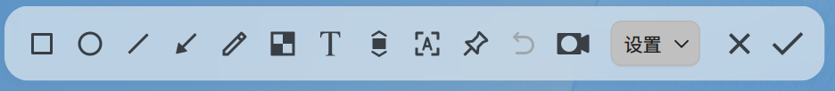

# 截图录屏|deepin-screen-recorder|

## 概述

截图录屏是一款集截图、录屏于一体的小工具，支持图片编辑、贴图、滚动截图、文字识别、录屏等功能。

## 使用入门

通过以下方式运行、关闭截图录屏，同时还可以创建快捷方式。

### 运行截图录屏

1. 单击任务栏上的启动器图标 ，进入启动器界面。
2. 上下滚动鼠标滚轮浏览或通过搜索，找到截图录屏图标 ，单击运行。
3. 右键单击 ，您可以：

   - 单击 **发送到桌面**，在桌面创建快捷方式。
   - 单击 **发送到任务栏**，将应用程序固定到任务栏。
   - 单击 **开机自动启动**，将应用程序添加到开机启动项，在电脑开机时自动运行该应用。

> 窍门：在任务栏系统插件区域中，单击图标 ，或右键单击该图标选择 **截图** 或 **录屏**，也可以启动截图录屏应用。

### 关闭截图录屏

- 截图录屏会在截图或录屏结束后自动退出。
- 在截图录屏界面，单击 ，关闭应用。
- 在截图界面，单击鼠标右键，选择 **保存** 或 **退出**。

### 快捷键

使用快捷键 **Ctrl + Shift + ?** 打开快捷键预览界面。熟练地使用快捷键，将大大提升您的操作效率。

## 选择和调整区域

### 选择截图录屏区域

截图录屏支持全屏、程序窗口和自选区域的选择。在截图录屏时选中对应的区域，该区域会高亮显示，且周围会出现白色虚线边框。

>  说明：当电脑多屏显示时，您也可以使用截图录屏来截取不同屏幕上的区域。

#### 选择全屏

截图录屏会自动识别当前显示器的整个屏幕。

&nbsp;&nbsp;&nbsp;&nbsp;&nbsp;&nbsp;&nbsp;&nbsp;&nbsp;&nbsp;&nbsp;&nbsp;&nbsp;

您可以通过操作以下步骤来选择全屏：

1. 使用快捷键 **Ctrl + Alt + A** 进入截图模式，或 **Ctrl + Alt + R** 进入录屏模式。
2. 将鼠标指针移至桌面上，截图录屏会自动选中整个屏幕，并在其左上角显示当前截图录屏区域的尺寸大小。
3. 鼠标左键单击桌面，弹出工具栏。

您也可以直接通过以下步骤来截取全屏：

- 如果您已经将截图录屏固定到任务栏，右键单击任务栏上的图标 ，选择 **全屏截图** 。
- 按下键盘上的  键，实现全屏截图。

#### 选择窗口

截图录屏会自动识别当前的应用窗口。

&nbsp;&nbsp;&nbsp;&nbsp;&nbsp;&nbsp;&nbsp;&nbsp;&nbsp;&nbsp;&nbsp;&nbsp;&nbsp;

1. 使用快捷键 **Ctrl + Alt + A** 进入截图模式，或 **Ctrl + Alt + R** 进入录屏模式。
2. 将鼠标指针移至打开的应用窗口上，截图录屏会自动选中该窗口，并在其左上角显示当前截图录屏区域的尺寸大小。
3. 鼠标左键单击窗口，弹出工具栏。

#### 自选区域

您还可以自由选择截图录屏的范围。

&nbsp;&nbsp;&nbsp;&nbsp;&nbsp;&nbsp;&nbsp;&nbsp;&nbsp;&nbsp;&nbsp;&nbsp;&nbsp;

1. 使用快捷键 **Ctrl + Alt + A** 进入截图模式，或 **Ctrl + Alt + R** 进入录屏模式。
2. 按住鼠标左键不放，拖动鼠标选择截图录屏区域，在其左上角将实时显示当前截图区域的尺寸大小。
3. 释放鼠标左键完成区域选择，弹出工具栏。

### 调整截图录屏区域

您可以对截图录屏区域进行微调，例如放大缩小截取范围，移动选区位置等。

#### 放大/ 缩小区域

- 将鼠标指针置于截图录屏区域的白色边框上，鼠标指针变为 ，
按住鼠标左键不放，拖动鼠标放大或缩小区域。
- 按下键盘上的 **Ctrl** +  或  来上下扩展区域，按下键盘上的 **Ctrl** +  或  来左右扩展区域。

&nbsp;&nbsp;&nbsp;&nbsp;&nbsp;&nbsp;&nbsp;&nbsp;&nbsp;&nbsp;&nbsp;&nbsp;&nbsp;

#### 移动区域位置

将鼠标指针置于截图录屏区域上，鼠标指针为 ，您可以：
- 按住鼠标左键不放，拖动鼠标来移动区域的位置。
- 按下键盘上的  或  来上下移动区域，按下键盘上的  或  来左右移动区域。

## 截图

在截图模式下，单击工具栏上的按钮，您可以在截图区域绘制图形、编辑图形、添加文字批注、识别图片中的文字等。

<table class="block1">
    <caption>工具栏说明</caption>
    <tbody>
        <tr>
            <td></td>
            <td>贴图</td>
            <td></td>
            <td>滚动截图</td>
            <td></td>
            <td>识别文字</td>
        </tr>
        <tr>
            <td></td>
            <td>矩形工具</td>
            <td></td>
            <td>椭圆工具</td>
            <td></td>
            <td>直线工具</td>
        </tr>
        <tr>
             <td></td>
            <td>画笔工具</td>
            <td></td>
            <td>文本工具</td>
            <td></td>
            <td>退出截图</td>
        </tr>
    </tbody>
</table>

>  说明：如果您已经对工具栏和属性栏中如线条粗细、字体大小等进行了选择，截图录屏会保存设置，再次启动截图录屏，将默认使用该设置，您也可以重新进行选择。

### 绘制图形

通过截图工具栏上的按钮可以绘制简单的图形。选择图形工具后，按住键盘上 **Shift** 键，拖动鼠标绘制正方形、圆形或水平/垂直方向的直线。

#### 矩形工具

&nbsp;&nbsp;&nbsp;&nbsp;&nbsp;&nbsp;&nbsp;&nbsp;&nbsp;&nbsp;&nbsp;&nbsp;&nbsp;

1. 在截图工具栏中，单击 。
2. 在工具栏展开的面板中，选择矩形边线的粗细及颜色，有四种颜色可供选择。
3. 将鼠标指针置于截图区域上，鼠标指针变为 。
4. 按住鼠标左键不放，拖动鼠标完成图形区域的绘制。
5. 如果截图中包含了个人隐私信息，可单击工具栏展开面板中的  或  来涂抹。

&nbsp;&nbsp;&nbsp;&nbsp;&nbsp;&nbsp;&nbsp;&nbsp;&nbsp;&nbsp;&nbsp;&nbsp;&nbsp;

&nbsp;&nbsp;&nbsp;&nbsp;&nbsp;&nbsp;&nbsp;&nbsp;&nbsp;&nbsp;&nbsp;&nbsp;&nbsp;

#### 椭圆工具

&nbsp;&nbsp;&nbsp;&nbsp;&nbsp;&nbsp;&nbsp;&nbsp;&nbsp;&nbsp;&nbsp;&nbsp;&nbsp;

1. 在截图工具栏中，单击 。
2. 在工具栏展开的面板中，选择椭圆边线的粗细和颜色，有四种颜色可供选择。
3. 将鼠标指针置于截图区域上，鼠标指针变为 。
4. 按住鼠标左键不放，拖动鼠标完成图形区域的绘制。
5. 如果截图中包含了个人隐私信息，可单击工具栏展开面板中的  或  来涂抹。

#### 直线和箭头工具

&nbsp;&nbsp;&nbsp;&nbsp;&nbsp;&nbsp;&nbsp;&nbsp;&nbsp;&nbsp;&nbsp;&nbsp;&nbsp;

1. 在截图工具栏中，单击 。
2. 在工具栏展开的面板中，选择线条的粗细和颜色，有四种颜色可供选择。
3. 单击  或 ，在直线和箭头之间切换。
4. 将鼠标指针置于截图区域上，鼠标指针变为  或 。
5. 按住鼠标左键不放，拖动鼠标完成图形区域的绘制。

#### 画笔工具

&nbsp;&nbsp;&nbsp;&nbsp;&nbsp;&nbsp;&nbsp;&nbsp;&nbsp;&nbsp;&nbsp;&nbsp;&nbsp;

1. 在截图工具栏中，单击 。
2. 在工具栏展开的面板中，选择画笔的粗细和颜色，有四种颜色可供选择。
3. 将鼠标指针置于截图区域上，鼠标指针变为 。
4. 按住鼠标左键不放，拖动鼠标完成图形区域的绘制。

### 修改图形

如果您在截图中绘制了其他的图形，可以对图形进行修改和移动。

#### 移动图形

1. 将鼠标指针置于图形的边线上，此时鼠标指针变为 。
2. 按住鼠标左键不放，将图形移动到截图区域的任何位置。
3. 按下键盘上的  或  来上下移动图形，按下键盘上的  或  来左右移动图形。

#### 编辑图形

1. 将鼠标指针置于图形的边线上，此时鼠标指针变为 。
2. 单击鼠标左键，进入图形的编辑模式，您可以：
   - 按下键盘上的 **Delete** 键，删除图形。
   - 将鼠标指针置于编辑框上，此时鼠标指针变成 ，通过拖动鼠标指针，来放大或缩小图形区域。
   - 按下键盘上的 **Ctrl** +  或  来上下扩展图形区域，按下键盘上的 **Ctrl** +  或  来左右扩展图形区域。
   - 将鼠标指针置于编辑框的  上，此时鼠标指针变成 ，通过拖动鼠标指针，来旋转图形。
3. 在编辑框外单击鼠标左键，退出编辑模式。

### 添加文字批注

对截取的图片进行文字补充和说明，帮助他人更清晰地了解截取的图片。

&nbsp;&nbsp;&nbsp;&nbsp;&nbsp;&nbsp;&nbsp;&nbsp;&nbsp;&nbsp;&nbsp;&nbsp;&nbsp;

1. 在截图工具栏中，单击 。
2. 在工具栏展开的面板中，选择字号和颜色，有四种颜色可供选择。
3. 将鼠标指针置于截取的图片上，此时鼠标指针变为 。
4. 单击要添加批注的地方，将出现一个待输入的文本框。
5. 在文本框中输入文字。

### 修改文字批注

如果您已经添加了文字批注，可以对文字批注进行修改和移动。

#### 移动文字批注

1. 将鼠标指针置于文字上，此时鼠标指针变为 。
2. 按住鼠标左键不放，将文字移到截图区域的任何位置。

#### 编辑文字批注

1. 将鼠标指针置于文字上，此时鼠标指针变为 。
2. 双击鼠标左键，进入文字编辑模式，您可以：
   - 按下键盘上的 **Delete** 键，删除文字批注。
   - 在文本框内，修改文字信息。
3. 在文本框外单击鼠标左键，退出编辑模式。

### 贴图|pinscreenshots

通过贴图功能将截图变为桌面浮窗，方便您快速查阅、对比和梳理信息。

选择需要截取的区域后，单击工具栏上的贴图按钮 ，截图浮于桌面上即为贴图，您可以对贴图进行如下操作：

- 通过鼠标或键盘移动图片的位置。
- 将鼠标指针置于图片上，向上或向下滚动鼠标滚轮等比缩放图片。
- 单击按钮  保存图片。

### 滚动截图|scrollshot

滚动截图功能不仅可以截取屏幕内可见的内容，还能截取超过屏幕外的内容，满足一次性截取长图的需求。

前提条件： **控制中心 > 个性化** 中的窗口特效功能已开启。

1. 选择截图区域后，单击工具栏上的滚动截图按钮 。
2. 请将鼠标光标保持在滚动区域内，您可以使用自动滚动或手动滚动截图，也可以交替使用两种方式：

   - **自动滚动**：在截图区域中单击鼠标左键，光标所在的截图区域自动向上滚动，此时截取的图片会拼接为一张完整的长图。自动滚动过程中，在截图区域内单击鼠标左键，或者将光标移出截图区域，暂停截图；再次单击截图区域，继续截图。

   - **手动滚动**：将鼠标光标置于截图区域中，向上或者向下滚动鼠标滚轮截取图片。停止滚动鼠标滚轮，暂停截图；再次滚动鼠标滚轮，继续截图。

3. 单击工具栏中的截图按钮  保存长图。

注意事项：
- 截图区域尽量不超出滚动范围，避免框选整个窗口、全屏等。
- 截图区域不宜过小，建议高度大于等于50px。
- 截图区域中尽量避免存在多个滚动区域。
- 滚动截图区域中尽量不包含大量重复内容，如空白区域、相同颜色、大段相同文字等。
- 滚动截图区域中尽量不包含动图、视频、水印、纯色背景等信息。
- 滚动操作时保持垂直方向偏移，避免滑动滚动条。
- 滚动操作时尽量不要切换窗口。
- 滚动操作速度不宜过快。

### 识别文字

对于截图区域中无法复制的内容，可以使用识别文字功能提取文字。

1. 选择截图区域后，单击工具栏上的文字识别按钮 ，弹出图文识别窗口，识别图片中的文字。
2. 您可以对识别出的文字进行编辑、复制或保存为TXT等操作。

### 延时截图

您可以通过延时截图功能，捕捉特定状态或时间下的屏幕内容。

- 将截图录屏图标固定在任务栏，右键单击图标，选择 **延时截图**。
- 使用快捷键 **Ctrl** + ，启动延时截图。
- 在终端中执行命令 “deepin-screen-recorder -d n”，其中n表示以秒为单位的延时时长。

   

### 保存截图

将截取的图片保存下来，为后续的使用储存素材！

当截图保存成功之后，桌面上方弹出提示信息，单击 **查看**，打开截图所在的文件夹。

开启截图录屏，选定截图区域后，通过以下操作之一来保存截取的图片：

- 双击鼠标左键来保存。
- 单击工具栏中的截图按钮 。
- 使用快捷键 **Ctrl + S** 来保存。
- 单击鼠标右键，选择 **保存**。

   >  说明：在以上操作中，截取的图片默认存放到 **图片 > Screenshots** 文件夹中。

您还可以在截图工具栏中，单击 **选项** 的下拉菜单：

&nbsp;&nbsp;&nbsp;&nbsp;&nbsp;&nbsp;&nbsp;&nbsp;&nbsp;&nbsp;&nbsp;&nbsp;&nbsp;

- 选择 **剪贴板**，将图片保存到剪贴板中。
- 选择 **桌面**，将图片保存到桌面。
- 选择 **图片**，截图文件自动保存到图片文件夹目录下。
- 选择 **指定位置**，截图文件将保存到用户设定的文件夹目录下。
- 选择 **显示光标**，光标在截图区域内，截图生成图片时会同时显示光标所在的位置和样式。
- 选择 **PNG/JPG/BMP**，设置图片格式。

## 录屏

在录屏模式下，单击录屏工具栏上的按钮，您可以录制声音、摄像头画面、按键显示、鼠标点击等。

>  说明：采用不同的解码技术，其所支持的功能也会不同，具体请参考应用界面。

<table class="block1">
    <caption>工具栏说明</caption>
    <tbody>
        <tr>
            <td></td>
            <td>麦克风</td>
            <td></td>
            <td>系统音频</td>
            <td></td>
            <td>显示按键</td>
            <td></td>
            <td>开启摄像头</td>
        </tr>
          <tr>
            <td></td>
            <td>显示光标</td>
            <td></td>
            <td>显示点击</td>
            <td></td>
            <td>退出录屏</td>
            <td></td>
            <td></td>
        </tr>
    </tbody>
</table>

### 录屏设置

在录屏工具栏中，您可以：

- 录制声音：在录制声音下拉选项中选择开启 **麦克风** 或 **系统音频**，也可以全部选择。
- 显示按键：单击按钮 ，录屏时显示键盘按键操作，最多同时显示5个按键操作。
- 开启摄像头：单击按钮  ，启动摄像头，录屏时同时录制摄像头画面和屏幕画面，拖拽摄像头窗口可以调整位置。

   >  注意：请先检测接入的设备是否支持声音录制或摄像头功能，若不支持，则无法进行相应的操作。

- 录制鼠标操作：在录制鼠标下拉选项中可以选择 **显示光标** 或 **显示点击**，也可以全部选择。
- 选项：在选项下拉菜单中选择 **GIF** 、 **MP4** 或 **MKV** 视频格式，并选择视频帧率。

   >  说明：MIPS架构不支持GIF格式。

### 录制屏幕

通过以下步骤，捕捉屏幕活动。

1. 使用快捷键 **Ctrl + Alt + R** 启动录屏。
2. 选择录屏区域。
3. 在录屏工具栏中，对录屏进行相关的设置。
4. 单击录屏按钮 ，3秒倒计时结束后开始录制，此时托盘区域出现录制图标并闪烁。
5. 您可以使用以下方法结束录制：
   - 使用快捷键 **Ctrl + Alt + R**。
   - 单击任务栏上的截图录屏图标。
   - 单击托盘区域录制图标。

录屏结束后视频将自动保存到桌面。

>  说明：
> - 当任务栏在桌面的上方或下方时，托盘区域的录制图标会显示录制时长。
> - 在录制视频时，如果接入多屏显示器，不论多屏显示器为复制模式还是扩展模式，仅针对当前操作屏进行录屏。

## 查看帮助手册

启动截图录屏后按下键盘上的 **F1** 键可打开帮助手册。

