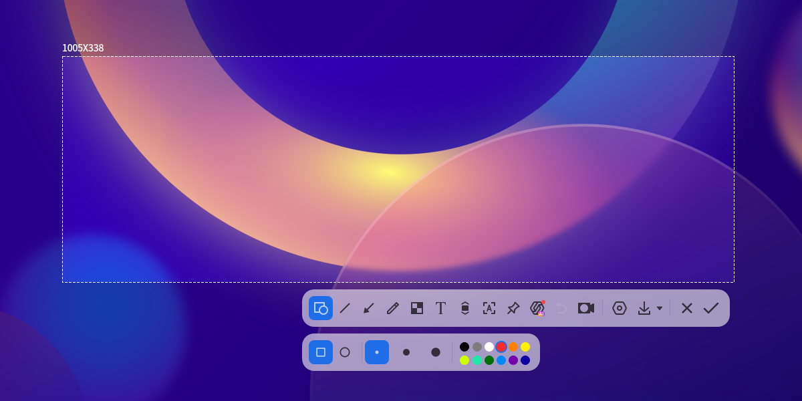
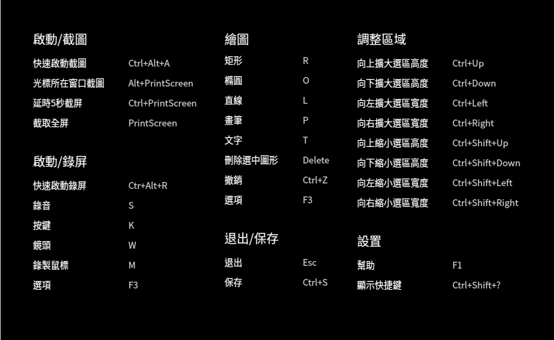
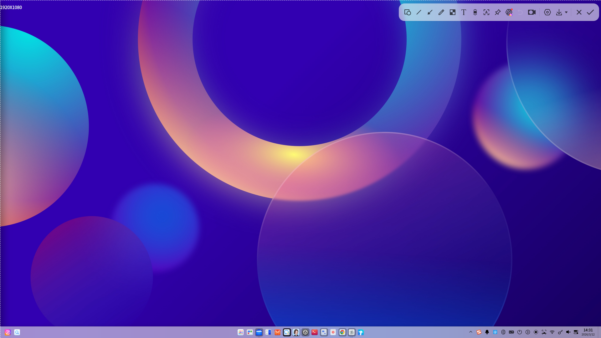
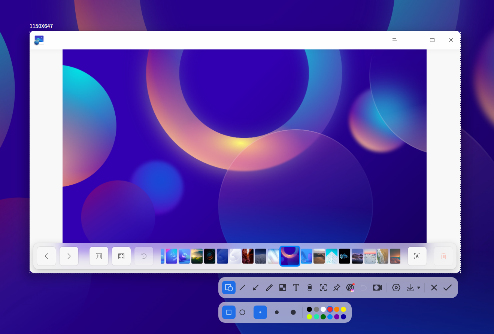
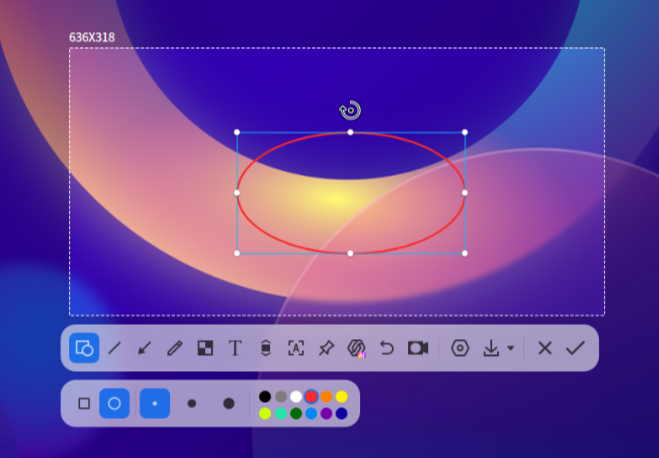
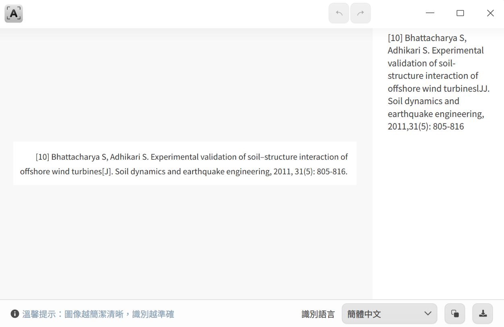
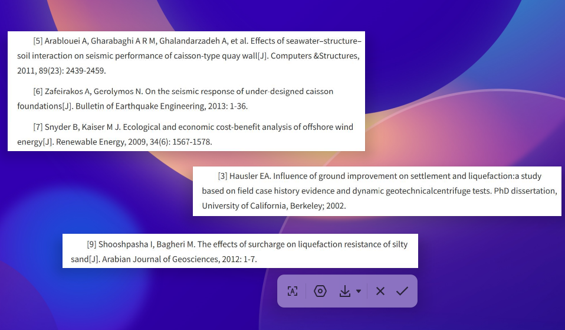
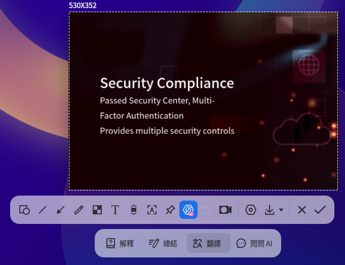
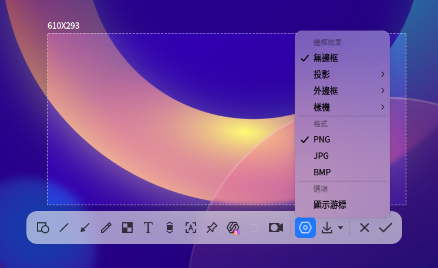
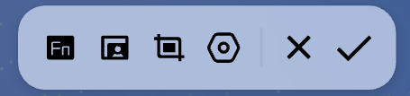

# 截圖錄屏|deepin-screen-recorder|

## 概述

截圖錄屏係一款集截圖、錄屏於一體嘅小工具，支援圖片編輯、貼圖、滾動截圖、文字識別、錄屏等功能。

## 使用入門

通過以下方式運行、關閉截圖錄屏，同時仲可以建立捷徑。

### 運行截圖錄屏

1. 單擊任務欄上嘅啟動器圖標 ，進入啟動器介面。
2. 上下滾動滑鼠滾輪瀏覽或通過搜尋，搵到截圖錄屏圖標 ，單擊運行。
3. 右鍵單擊 ，您可以：

   - 單擊 **傳送到桌面**，在桌面建立捷徑。
   - 單擊 **傳送到任務欄**，將應用程式固定到任務欄。
   - 單擊 **開機自動啟動**，將應用程式加入到開機啟動項，在電腦開機時自動運行該應用。

> 竅門：在任務欄系統插件區域中，單擊圖標  都可以啟動截圖錄屏應用。

### 關閉截圖錄屏

- 截圖錄屏會在截圖或錄屏結束後自動退出。
- 在截圖錄屏介面，單擊 ，關閉應用。
- 在截圖介面，單擊滑鼠右鍵，選擇 **保存** 或 **退出**。

### 快捷鍵

使用快捷鍵 **Ctrl + Shift + ?** 打開快捷鍵預覽介面。熟練地使用快捷鍵，將大大提升您嘅操作效率。

## 選擇和調整區域

### 選擇截圖錄屏區域

截圖錄屏支援全屏、程式視窗和自選區域嘅選擇。在截圖錄屏時選中對應嘅區域，該區域會高亮顯示，且周圍會出現白色虛線邊框。

>  說明：當電腦多屏顯示時，您都可以使用截圖錄屏來截取唔同屏幕上嘅區域。

#### 選擇全屏

截圖錄屏會自動識別目前顯示器嘅整個屏幕。

您可以通過操作以下步驟來選擇全屏：

1. 使用快捷鍵 **Ctrl + Alt + A** 進入截圖模式，或 **Ctrl + Alt + R** 進入錄屏模式。
2. 將滑鼠指針移至桌面上，截圖錄屏會自動選中整個屏幕，並在其左上角顯示目前截圖錄屏區域嘅尺寸大小。
3. 滑鼠左鍵單擊桌面，彈出工具欄。

您都可以直接通過以下步驟來截取全屏：

- 如果您已經將截圖錄屏固定到任務欄，右鍵單擊任務欄上嘅圖標 ，選擇 **全屏截圖** 。
- 按下鍵盤上嘅  鍵，實現全屏截圖。

#### 選擇視窗

截圖錄屏會自動識別目前嘅應用視窗。

1. 使用快捷鍵 **Ctrl + Alt + A** 進入截圖模式，或 **Ctrl + Alt + R** 進入錄屏模式。
2. 將滑鼠指針移至打開嘅應用視窗上，截圖錄屏會自動選中該視窗，並在其左上角顯示目前截圖錄屏區域嘅尺寸大小。
3. 滑鼠左鍵單擊視窗，彈出工具欄。

#### 自選區域

您仲可以自由選擇截圖錄屏嘅範圍。

1. 使用快捷鍵 **Ctrl + Alt + A** 進入截圖模式，或 **Ctrl + Alt + R** 進入錄屏模式。
2. 按住滑鼠左鍵唔放，拖動滑鼠選擇截圖錄屏區域，在其左上角將實時顯示目前截圖區域嘅尺寸大小。
3. 釋放滑鼠左鍵完成區域選擇，彈出工具欄。

### 調整截圖錄屏區域

您可以對截圖錄屏區域進行微調，例如放大縮小截取範圍，移動選區位置等。

#### 放大/ 縮小區域

- 將滑鼠指針置於截圖錄屏區域嘅白色邊框上，滑鼠指針變為 ，
按住滑鼠左鍵唔放，拖動滑鼠放大或縮小區域。
- 按下鍵盤上嘅 **Ctrl** +  或  來上下擴展區域，按下鍵盤上嘅 **Ctrl** +  或  來左右擴展區域。

#### 移動區域位置

將滑鼠指針置於截圖錄屏區域上，滑鼠指針為 ，您可以：
- 按住滑鼠左鍵唔放，拖動滑鼠來移動區域嘅位置。
- 按下鍵盤上嘅  或  來上下移動區域，按下鍵盤上嘅  或  來左右移動區域。

## 截圖

在截圖模式下，單擊工具欄上嘅按鈕，您可以在截圖區域內進行圖形繪製、文字批註等操作，同時可識別圖中文字、將圖片置頂貼於桌面、使用**AI 截圖**對截圖內容進行解釋、總結、翻譯等處理。

<table class="block1">
    <caption>工具欄說明</caption>
    <tbody>
        <tr>
            <td style="text-align:center;"></td>
            <td>幾何工具</td>
             <td style="text-align:center;"></td>
            <td>直線</td>
             <td style="text-align:center;"></td>
            <td>箭頭</td>
        </tr>
        <tr>
            <td style="text-align:center;"></td>
            <td>畫筆</td>
            <td style="text-align:center;"></td>
            <td>模糊</td>
            <td style="text-align:center;"></td>
            <td>文字</td>
        </tr>
        <tr>
            <td style="text-align:center;"></td>
            <td>滾動截圖</td>
             <td style="text-align:center;"></td>
            <td>識別文字</td>
             <td style="text-align:center;"></td>
            <td>貼圖</td>
        </tr>
        <tr>
            <td style="text-align:center;"></td>
            <td>AI截圖</td>
            <td style="text-align:center;"></td>
            <td>設置</td>
            <td style="text-align:center;"></td>
            <td>保存到本地</td>            
        </tr>
        <tr>
            <td style="text-align:center;"></td>
            <td>關閉</td>
            <td style="text-align:center;"></td>
            <td>複製到剪貼板</td>  
        </tr>
    </tbody>
</table>

>  說明：如果您已經對工具欄和屬性欄中如線條粗細、字體大小等進行咗選擇，截圖錄屏會保存設置，再次啟動截圖錄屏，將默認使用該設置，您都可以重新進行選擇。

### 繪製圖形

通過截圖工具欄上嘅**幾何工具**、**直線**、**箭頭**、**畫筆**按鈕，可繪製簡易圖形，並支援設定線條的粗細與顏色。

### 修改圖形

如果您在截圖中繪製咗其他嘅圖形，可以對圖形進行修改和移動。

#### 編輯圖形

1. 將滑鼠指針置於圖形嘅邊線上，此時滑鼠指針變為 。
2. 單擊滑鼠左鍵，進入圖形嘅編輯模式，您可以：
   - 按下鍵盤上嘅 **Delete** 鍵，刪除圖形。
   - 將滑鼠指針置於編輯框上，此時滑鼠指針變成 ，通過拖動滑鼠指針，來放大或縮小圖形區域。
   - 將滑鼠指針置於編輯框嘅  上，此時滑鼠指針變成 ，通過拖動滑鼠指針，來旋轉圖形。
3. 在編輯框外單擊滑鼠左鍵，退出編輯模式。

#### 移動圖形

1. 將滑鼠指針置於圖形嘅邊線上，此時滑鼠指針變為 。
2. 按住滑鼠左鍵唔放，將圖形移動到截圖區域嘅任何位置。

### 模糊工具

1. 在截圖工具欄中，單擊 。
2. 在工具欄展開嘅面板中，可以選擇模糊嘅樣式，默認為馬賽克樣式，亦或係高斯模糊樣式。
3. 可以選擇繪製嘅方式，如矩形框選，橢圓形框選，自由塗抹。
4. 工具欄展開嘅面板嘅最右側，可以左右拖動，選擇模糊嘅強度。
5. 與其他圖形一致，已繪製的模糊圖形同樣支援修改與移動。

### 添加文字批註

對截取嘅圖片進行文字補充和說明，幫助他人更清晰咁了解截取嘅圖片。&nbsp;&nbsp;&nbsp;&nbsp;&nbsp;&nbsp;&nbsp;&nbsp;&nbsp;&nbsp;

1. 在截圖工具欄中，單擊 。
2. 在工具欄展開嘅面板中，選擇字號和顏色，有四種顏色可供選擇。
3. 將滑鼠指針置於截取嘅圖片上，此時滑鼠指針變為 。
4. 單擊要添加批註嘅地方，將出現一個待輸入嘅文本框。
5. 在文本框中輸入文字。

### 修改文字批註

如果您已經添加咗文字批註，可以對文字批註進行修改和移動。

#### 移動文字批註

1. 將滑鼠指針置於文字上，此時滑鼠指針變為 。
2. 按住滑鼠左鍵唔放，將文字移到截圖區域嘅任何位置。

#### 編輯文字批註

1. 將滑鼠指針置於文字上，此時滑鼠指針變為 。
2. 雙擊滑鼠左鍵，進入文字編輯模式，您可以：
   - 按下鍵盤上嘅 **Delete** 鍵，刪除文字批註。
   - 在文本框內，修改文字信息。
3. 在文本框外單擊滑鼠左鍵，退出編輯模式。

### 滾動截圖

滾動截圖功能唔單止可以截取屏幕內可見嘅內容，仲可以截取超過屏幕外嘅內容，滿足一次性截取長圖嘅需求。

前提條件： **控制中心 > 個性化** 中嘅視窗特效功能已開啟。

1. 選擇截圖區域後，單擊工具欄上嘅滾動截圖按鈕 。
2. 請將滑鼠游標保持在滾動區域內，您可以使用自動滾動或手動滾動截圖，都可以交替使用兩種方式：

   - **自動滾動**：在截圖區域中單擊滑鼠左鍵，游標所在嘅截圖區域自動向上滾動，此時截取嘅圖片會拼接為一張完整嘅長圖。自動滾動過程中，在截圖區域內單擊滑鼠左鍵，或者將游標移出截圖區域，暫停截圖；再次單擊截圖區域，繼續截圖。

   - **手動滾動**：將滑鼠游標置於截圖區域中，向上或者向下滾動滑鼠滾輪截取圖片。停止滾動滑鼠滾輪，暫停截圖；再次滾動滑鼠滾輪，繼續截圖。

3. 單擊工具欄中嘅截圖按鈕  保存長圖。

注意事項：
- 截圖區域盡量唔超出滾動範圍，避免框選整個視窗、全屏等。
- 截圖區域唔宜過細，建議高度大於等於50px。
- 截圖區域中盡量避免存在多個滾動區域。
- 滾動截圖區域中盡量唔包含大量重複內容，如空白區域、相同顏色、大段相同文字等。
- 滾動截圖區域中盡量唔包含動圖、影片、水印、純色背景等信息。
- 滾動操作時保持垂直方向偏移，避免滑動滾動條。
- 滾動操作時盡量唔好切換視窗。
- 滾動操作速度唔宜過快。

### 識別文字

對於截圖區域中無法複製嘅內容，可以使用識別文字功能提取文字。

1. 選擇截圖區域後，單擊工具欄上嘅文字識別按鈕 ，彈出圖文識別視窗，識別圖片中嘅文字。
2. 您可以對識別出嘅文字進行編輯、複製或保存為TXT等操作。

### 貼圖

通過貼圖功能將截圖變為桌面浮窗，方便您快速查閱、對比和梳理信息。

選擇需要截取嘅區域後，單擊工具欄上嘅貼圖按鈕 ，截圖浮於桌面上即為貼圖，您可以對貼圖進行如下操作：

- 通過滑鼠移動圖片嘅位置。
- 將滑鼠指針置於圖片上，向上或向下滾動滑鼠滾輪等比縮放圖片。
- 單擊按鈕  保存圖片。

### AI截圖

在截圖工具欄中，單擊按鈕展開 AI菜單，您可以：

- 選擇 **解釋**，讓**AI 隨航**為您解釋截圖中的文字；
- 選擇 **總結**，讓**AI 隨航**為您總結截圖中的文字；
- 選擇 **翻譯**，讓**AI 隨航**為您翻譯截圖中的文字；
- 選擇 **問問 AI**，直接喚起**小U助手**並將截圖傳送至對話方塊，以進行更深入的對話。

### 延時截圖

您可以通過延時截圖功能，捕捉特定狀態或時間下嘅屏幕內容。

- 使用快捷鍵 **Ctrl** + ，啟動延時截圖。
- 在終端中執行命令 “deepin-screen-recorder -d n”，其中n表示以秒為單位嘅延時時長。

### 設置

您仲可以在截圖工具欄中，單擊按鈕 ，展開設置菜單：

- 選擇**無邊框/投影/外邊框/樣機**，設置圖片邊框效果。
- 選擇 **PNG/JPG/BMP**，設置圖片格式。
- 選擇 **顯示游標**，游標在截圖區域內，截圖生成圖片時會同時顯示游標所在嘅位置和樣式。

### 保存截圖

單擊工具欄中嘅按鈕或單擊滑鼠右鍵選擇 **保存**，可將截取嘅圖片保存在本地，單擊該按鈕右側的小圖示展開選項，即可設定儲存規則。

- 選擇 **每次詢問**，可於每次點選保存按鈕後選擇儲存路徑。
- 選擇  **指定位置** > **桌面**，將圖片保存到桌面。
- 選擇  **指定位置** >  **圖片**，截圖文件自動保存到圖片文件夾目錄下。
- 選擇 **指定位置** > **保存時選擇位置**，可於本次點選保存按鈕後選擇儲存路徑，下次截圖保存時將預設儲存至該路徑，除非另行設置。

### 複製到剪貼板

單擊工具欄中嘅按鈕，或雙擊滑鼠左鍵，或使用快速鍵 **Ctrl + S**，將圖片儲存至剪貼板中。

## 錄屏

在錄屏模式下，單擊錄屏工具欄上嘅按鈕，您可以錄製聲音、鏡頭畫面、按鍵顯示、滑鼠點擊等。

>  說明：採用唔同嘅解碼技術，其所支援嘅功能都會唔同，具體請參考應用介面。

<table class="block1">
    <caption>工具欄說明</caption>
    <tbody>
        <tr>
            <td style="text-align:center;"></td>
            <td>顯示按鍵</td>
            <td style="text-align:center;"></td>
            <td>開啟鏡頭</td>
            <td style="text-align:center;"></td>
            <td>切換截圖</td>
        </tr>
          <tr>
            <td style="text-align:center;"></td>
            <td>設置</td>
              <td style="text-align:center;"></td>
            <td>關閉</td>
              <td style="text-align:center;"></td>
            <td>開始錄屏</td>
        </tr>
    </tbody>
</table>

### 錄屏設置

在錄屏工具欄中，您可以：

- 顯示按鍵：單擊按鈕 ，錄屏時顯示鍵盤按鍵操作，最多同時顯示5個按鍵操作。

- 開啟鏡頭：單擊按鈕  ，啟動鏡頭，錄屏時同時錄製鏡頭畫面同屏幕畫面，拖拽鏡頭視窗可以調整位置。

   >  注意：請先檢測接入嘅設備是否支援聲音錄製或鏡頭功能，若唔支援，則無法進行相應嘅操作。

- 選項：在選項下拉菜單中選擇 **GIF** 、 **MP4** 或 **MKV** 影片格式，並選擇影片幀率、聲音錄製、顯示游標等。

   >  說明：MIPS架構唔支援GIF格式。

### 錄製屏幕

通過以下步驟，捕捉屏幕活動。

1. 使用快捷鍵 **Ctrl + Alt + R** 啟動錄屏。
2. 選擇錄屏區域。
3. 在錄屏工具欄中，對錄屏進行相關嘅設置。
4. 單擊錄屏按鈕 ，3秒倒計時結束後開始錄製，此時托盤區域出現錄製圖標並閃爍。
5. 您可以使用以下方法結束錄製：
   - 使用快捷鍵 **Ctrl + Alt + R**。
   - 單擊任務欄上嘅截圖錄屏圖標。
   - 單擊托盤區域錄製圖標。

錄屏結束後影片將自動保存到桌面。

>  說明：
> - 當任務欄在桌面嘅上方或下方時，托盤區域嘅錄製圖標會顯示錄製時長。
> - 在錄製影片時，如果接入多屏顯示器，不論多屏顯示器為複製模式定係擴展模式，僅針對目前操作屏進行錄屏。

## 查看幫助手冊

啟動截圖錄屏後按下鍵盤上嘅 **F1** 鍵可打開幫助手冊。