# 熒幕錄影|deepin-screen-recorder|

## 概述

熒幕錄影是一款集截圖和錄屏於一體的小巧工具，不僅支援多種方式來選擇截圖錄屏區域，還支援對圖片進行編輯，對螢幕活動進行設定等功能。

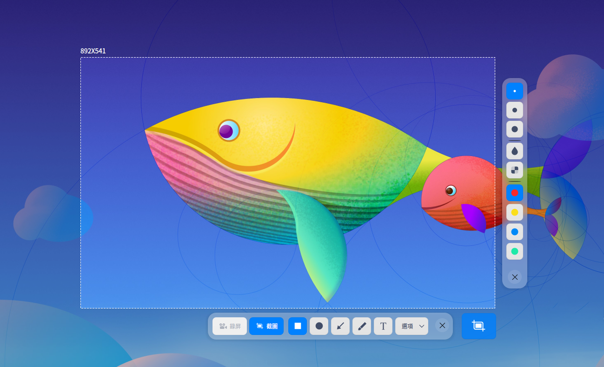

## 使用入門

透過以下方式執行、關閉熒幕錄影，同時還可以建立捷徑。

### 執行熒幕錄影

1. 單擊桌面底部的 ，進入啟動器介面。
2. 上下滾動滑鼠滾輪瀏覽或透過搜尋，找到熒幕錄影 單擊執行。
3. 右鍵單擊 ，您可以：

   - 單擊 **建立桌面捷徑**，在桌面建立捷徑。
   - 單擊 **釘選到Dock**，將應用程式固定到Dock。
   - 單擊 **開機啟動**，將應用程式添加到開機啟動項，在電腦開機時自動執行該應用。

### 關閉熒幕錄影

- 熒幕錄影會在截圖或錄屏結束後自動關閉。
- 在熒幕錄影介面，單擊，關閉應用。
- 在熒幕錄影介面，單擊滑鼠右鍵，選擇 **儲存** 或 **退出**。

### 快捷鍵

按下鍵盤上的 **Ctrl + Shift + ?** 快捷鍵，打開快捷鍵預覽介面。

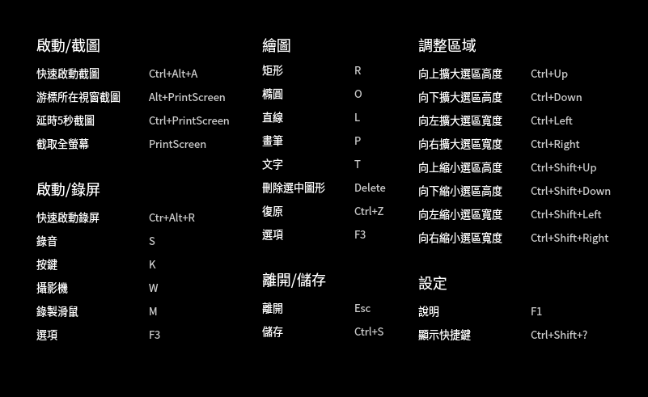
## 選擇和調整區域

### 選擇截圖錄屏區域

截圖錄屏支援全螢幕、程式視窗和自選區域的選擇。在截圖錄屏時選中對應的區域，該區域會突顯顯示，且周圍會出現白色虛線邊框。

> 說明：當電腦多屏顯示時，您也可以使用截圖錄屏來截取不同螢幕上的區域。

#### 選擇全螢幕

選擇全螢幕是識別目前顯示器的整個螢幕。

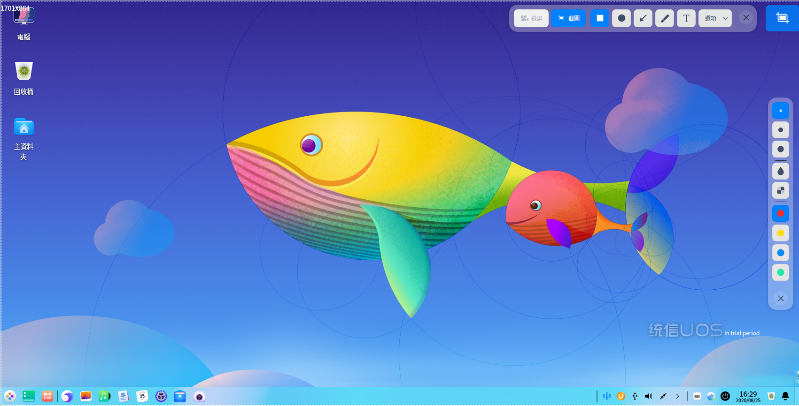

您可以透過操作以下步驟來選擇全螢幕：

1. 使用快捷鍵 **Ctrl + Alt + A** 進入截圖模式，或 **Ctrl + Alt + R** 進入錄屏模式。
2. 將滑鼠指標移至桌面上，錄屏截圖會自動選中整個螢幕，並在其左上角顯示目前截圖區域的尺寸大小。
3. 滑鼠左鍵單擊桌面，彈出工具列。

您也可以直接操作以下步驟來進行全屏截圖：

- 如果您已經將熒幕錄影固定到任務欄，右鍵單擊任務欄上的，然後選擇截取全螢幕 。
- 按下鍵盤上的  鍵，實現全螢幕截圖。

#### 選擇視窗

選擇程式視窗是自動識別目前的應用視窗。

1. 按下鍵盤上的 **Ctrl + Alt + A** 組合鍵，進入截圖模式，或 **Ctrl + Alt + R** 進入錄屏模式。
2. 將滑鼠指標移至打開的應用視窗上，熒幕錄影會自動選中該視窗，並在其左上角顯示目前截圖錄屏區域的尺寸大小。
3. 單擊視窗，彈出工具列。

#### 自選區域

您還可以自由選擇截圖錄屏的範圍。

1.  使用快捷鍵 **Ctrl + Alt + A** 進入截圖模式，或 **Ctrl + Alt + R** 進入錄屏模式。
2. 按住滑鼠左鍵不放，拖動滑鼠選擇截圖區域，在其左上角將即時顯示目前截圖區域的尺寸大小。
3. 釋放滑鼠左鍵完成區域選擇，彈出工具列。

### 調整截圖區域

您可以對截圖區域進行微調，例如放大或縮小截取範圍，移動截圖等。

#### 放大/ 縮小截圖區域

- 將滑鼠指標置於截圖錄屏區域的白色邊框上，滑鼠指標變為 

  ，按住滑鼠左鍵不放，拖動滑鼠來放大或縮小截圖區域。

- 按下鍵盤上的 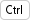+ 或  來上下擴展截圖區域，按下鍵盤上的 + 或  來左右擴展截圖區域。

&nbsp;&nbsp;&nbsp;&nbsp;&nbsp;&nbsp;&nbsp;&nbsp;&nbsp;&nbsp;&nbsp;&nbsp;&nbsp;

#### 移動區域位置

將滑鼠指標置於截圖錄屏區域上，滑鼠指標變為 。您可以：
- 按住滑鼠左鍵不放，拖動滑鼠來移動區域的位置。
- 按下鍵盤上的 或 來上下移動區域，按下鍵盤上的 或 來左右移動區域。

## 截圖

在截圖模式下，單擊工具列上的按鈕，您可以在截圖區域繪製圖形、編輯圖形、添加文字批註等。

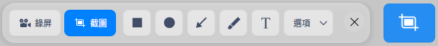

<table class="block1">
    <caption>工具列說明</caption>
    <tbody>
        <tr>
            <td></td>
            <td>矩形工具</td>
            <td></td>
            <td>橢圓工具</td>
            <td></td>
            <td>線條工具</td>
        </tr>
          <tr>
            <td></td>
            <td>畫筆工具</td>
            <td></td>
            <td>文字工具</td>
            <td></td>
            <td>退出截圖</td>
        </tr>
    </tbody>
</table>

> 說明：如果您已經對工具列和屬性欄中如線條粗細、字體大小等進行了選擇，截圖錄屏會儲存設定，再次啟動截圖錄屏，將預設使用該設定，您也可以重新進行選擇。

### 繪製圖形

透過截圖工具列上的按鈕可繪製簡單的圖形，選擇圖形工具後，按住鍵盤上 **Shift** 鍵，拖動滑鼠繪製正方形、圓形或水平/垂直方向的直線。

#### 矩形工具

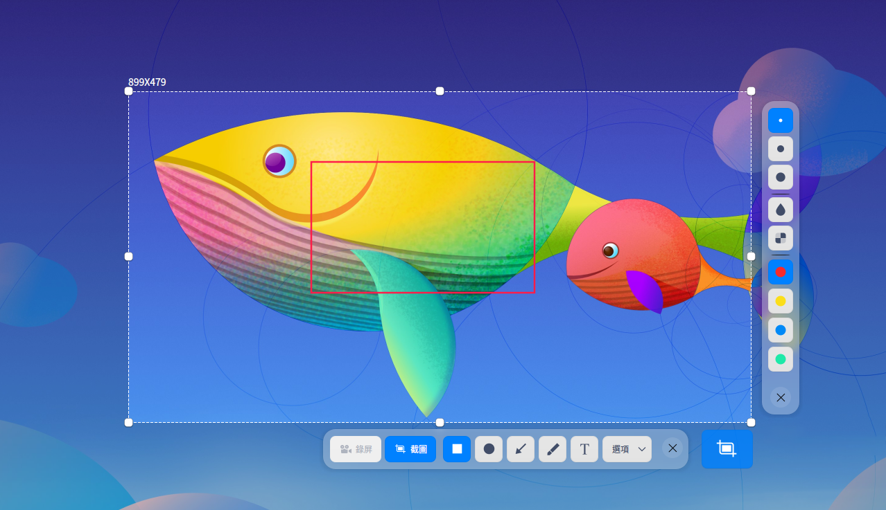

&nbsp;&nbsp;&nbsp;&nbsp;&nbsp;&nbsp;&nbsp;&nbsp;&nbsp;&nbsp;&nbsp;&nbsp;&nbsp;

1. 在截圖工具列中，單擊 。
2.  在工具列展開的面板中，選擇矩形邊線的粗細及顏色，有四種顏色可供選擇。
3. 將滑鼠指標置於截圖區域上，滑鼠指標變為 。
4. 按住滑鼠左鍵不放，拖動滑鼠以完成圖形區域的繪製。
5. 如果截圖中包含了個人隱私訊息，請單擊工具列展開面板中的  或 來塗抹。

&nbsp;&nbsp;&nbsp;&nbsp;&nbsp;&nbsp;&nbsp;&nbsp;&nbsp;&nbsp;&nbsp;&nbsp;&nbsp;
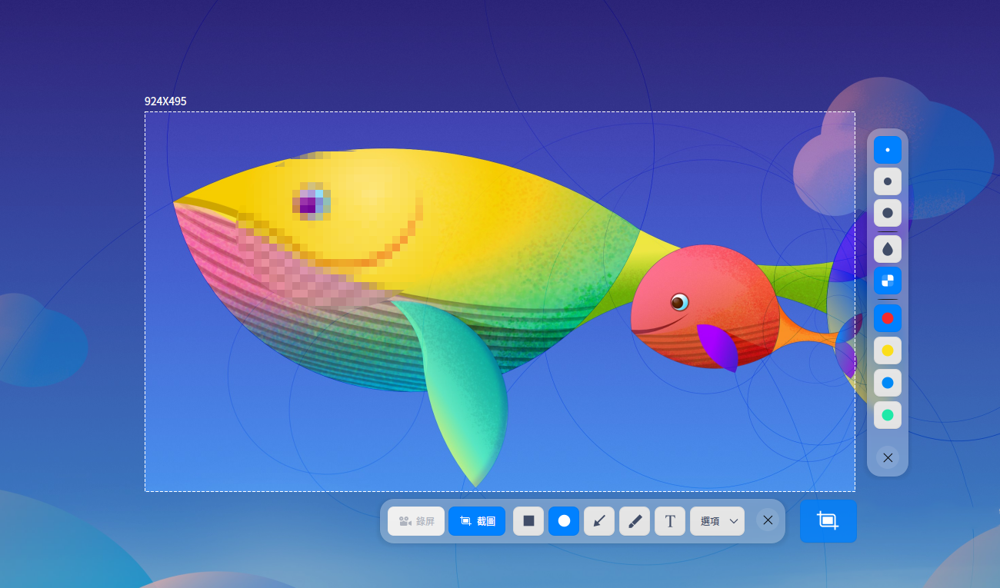
&nbsp;&nbsp;&nbsp;&nbsp;&nbsp;&nbsp;&nbsp;&nbsp;&nbsp;&nbsp;&nbsp;&nbsp;&nbsp;

#### 橢圓工具
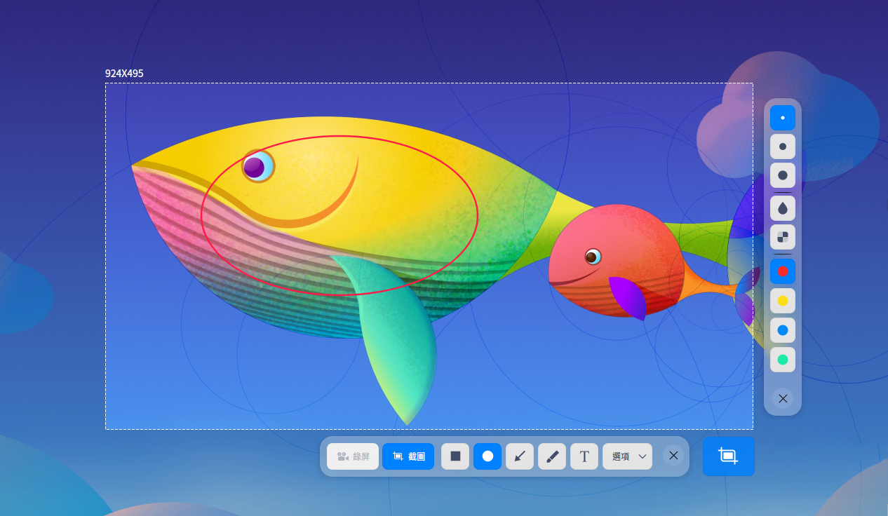

&nbsp;&nbsp;&nbsp;&nbsp;&nbsp;&nbsp;&nbsp;&nbsp;&nbsp;&nbsp;&nbsp;&nbsp;&nbsp;

1. 在截圖工具列中，單擊 。
2. 在工具列展開的面板中，選擇橢圓邊線的粗細和顏色，有四種顏色可供選擇。
3. 將滑鼠指標置於截圖區域上，滑鼠指標變為 。
4. 按住滑鼠左鍵不放，拖動滑鼠以完成圖形區域的繪製。
5. 如果截圖中包含了個人隱私訊息，請單擊工具列展開面板中的  或 來塗抹。

#### 直線和箭頭工具

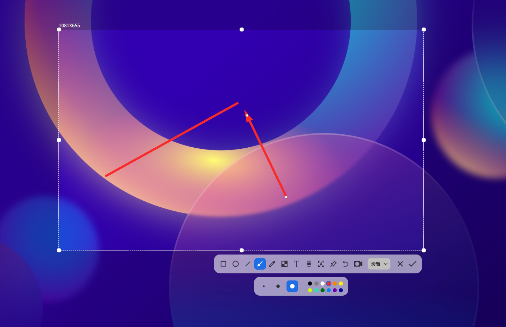

1. 在截圖區域下方的工具列中，單擊 。
2. 在工具列展開的面板中，選擇線條的粗細和顏色，有四種顏色可供選擇。
3. 單擊 或 ，在直線和箭頭之間切換。
4. 將滑鼠指標置於截圖區域上，滑鼠指標變為 或 。
5. 按住滑鼠左鍵不放，拖動滑鼠完成圖形區域的繪製。

#### 畫筆工具

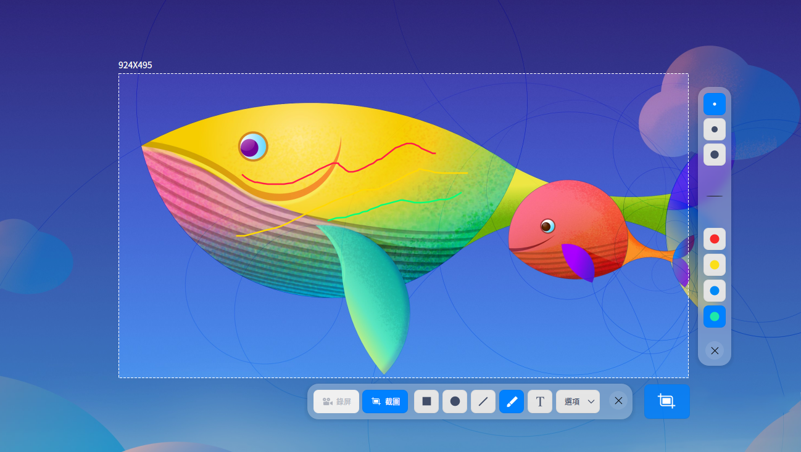

1. 在截圖區域下方的工具列中，單擊 。
2. 在工具列展開的面板中，選擇畫筆的粗細和顏色，有四種顏色可供選擇。
3. 將滑鼠指標置於截圖區域上，滑鼠指標變為 。
4. 按住滑鼠左鍵不放，拖動滑鼠完成圖形區域的繪製。

### 修改圖形
如果您在截圖中繪製了其他的圖形，您可以對繪製的圖形進行修改和移動。

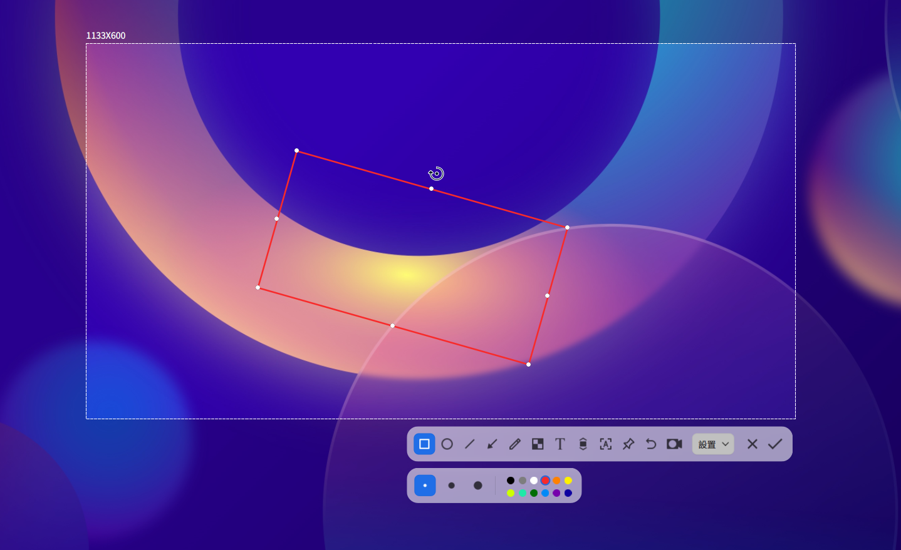

#### 移動圖形
1. 將滑鼠指標置於圖形的邊線上，此時滑鼠指標變為 。
2. 按住滑鼠左鍵不放，將圖形移動到截圖區域的任何位置。
3. 按下鍵盤上的  或  來上下移動圖形，按下鍵盤上的  或  來左右移動圖形。

#### 編輯圖形
1. 將滑鼠指標置於圖形的邊線上,此時滑鼠指標變為 。
2. 單擊滑鼠左鍵，進入圖形編輯模式，您可以：
   - 按下鍵盤上的 **Delete** 鍵，刪除圖形。
   - 將滑鼠指標置於編輯框上，此時滑鼠指標變成 ，透過拖動滑鼠指標，來放大或縮小圖形區域。
   - 按下鍵盤上的**Ctrl** + 或  來上下擴展圖形區域，按下鍵盤上的**Ctrl** + 或  來左右擴展圖形區域。
   - 將滑鼠指標置於編輯框的  上，此時滑鼠指標變成 ，透過拖動滑鼠指標，來旋轉圖形。
3. 在編輯框外單擊滑鼠左鍵，退出編輯模式。

### 添加文字批註

對截取的圖片進行文字補充和說明，幫助他人更清楚地了解截取的圖片。

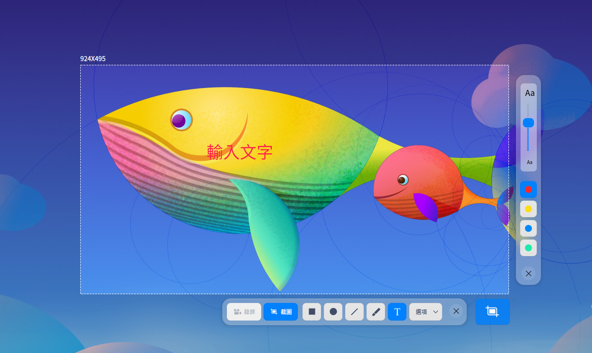

1. 在截圖區域下方的工具列中，單擊 。
2. 在工具列展開面板中，選擇字號和顏色，有四種顏色可供選擇。
3. 將滑鼠指標置於截取的圖片上，此時滑鼠指標變為 。
4. 單擊要添加批註的地方，將出現一個待輸入的文字框。
5. 在文字框中輸入文字。

### 修改文字批註

如果您已經添加了文字批註，可以對文字批註進行修改和移動。

#### 移動文字批註

1. 將滑鼠指標置於文字上，此時滑鼠指標變為 。
2. 按住滑鼠左鍵不放，將文字移動到截圖區域的任何位置。

#### 編輯文字批註
1. 將滑鼠指標置於文字上，此時滑鼠指標變為 。
2. 單擊滑鼠左鍵，進入文字編輯模式，您可以：
   - 按下鍵盤上的 **Delete** 鍵，刪除文字批註。
   - 在文字框內，修改文字訊息。
3. 在文字框外單擊滑鼠左鍵，退出編輯模式。

### 延時截圖

您可以透過延時截圖功能，捕捉特定狀態或時間下的螢幕內容。

- 將截圖錄屏圖示固定在任務欄，右鍵單擊圖示，選擇 **延時截圖**。
- 使用快捷鍵 **Ctrl** + ，啟動延時截圖。
- 在終端中執行指令 “deepin-screen-recorder -d n”，其中n表示以秒為單位的延時時長。

### 儲存截圖

將截取的圖片儲存下來，為後續的使用儲存素材！

當截圖儲存成功之後，桌面上方提示訊息，單擊 **查看**，打開截圖所在的資料夾。

開啟熒幕錄影，選定截圖區域後，透過執行以下操作之一來儲存截取的圖片：

- 雙擊滑鼠左鍵儲存。
- 單擊截圖工具列中的按鈕。
- 按下鍵盤上的 **Ctrl + S** 快捷鍵儲存。
- 單擊滑鼠右鍵，選擇 **儲存** 完成儲存操作。

> 說明：在以上操作中，截取的圖片預設存放到剪貼簿。

您還可以在截圖介工具列中，單擊 **選項** 的下拉選項：

&nbsp;&nbsp;&nbsp;&nbsp;&nbsp;&nbsp;&nbsp;&nbsp;&nbsp;&nbsp;&nbsp;&nbsp;&nbsp;

- 選擇 **剪貼簿**，將圖片儲存到剪貼簿中。
- 選擇 **桌面**，預設設定，將圖片儲存到桌面。
- 選擇 **圖片**，截圖文件自動儲存到圖片資料夾目錄下。
- 選擇 **指定位置**，截圖文件將自動儲存到使用者設定的資料夾目錄下。
- 選擇 **顯示游標**，游標在截圖區域內，截圖生成圖片時會同時顯示游標所在的位置和樣式。
- 選擇 **PNG/JPG/BMP**，設定圖片格式。

## 錄屏

在錄屏模式下，單擊錄屏工具列上的按鈕，您可以錄製聲音、攝影機畫面、按鍵顯示、滑鼠點擊等。

<table class="block1">
    <caption>工具列說明</caption>
    <tbody>
        <tr>
            <td></td>
            <td>麥克風</td>
            <td></td>
            <td>系統音訊</td>
            <td></td>
            <td>顯示按鍵</td>
               <td></td>
            <td>開啟攝影機</td>
        </tr>
          <tr>
            <td></td>
            <td>显示游標</td>
            <td></td>
            <td>显示鼠标點擊</td>
            <td></td>
            <td>退出錄屏</td>
             <td></td>
             <td></td>
        </tr>
    </tbody>
</table>

> 說明：SW平台不支援錄屏功能。

### 錄屏設定

在錄屏工具列中，您可以設定：

- 錄製聲音：在錄製聲音下拉選項中選擇開啟 **麥克風 **或 **系統音訊**，也可以全部選擇。
- 顯示按鍵：單擊，錄屏時顯示鍵盤按鍵操作，最多同時顯示5個按鍵操作。
- 開啟攝影機：單擊，啟動攝影機，錄屏時同時錄製攝影機畫面和螢幕畫面，拖曳攝影機視窗可以調整位置。
- 錄製滑鼠操作：在錄製滑鼠下拉選項中可以選擇 **顯示游標 **或 **顯示點擊**，也可以全部選擇。
> 注意：請先檢測接入裝置是否支援聲音錄製、攝影機功能，若不支援，則無法進行相應的操作。
- 選項：在選項下拉選單中選擇 **GIF** 、 **MP4** 或 **MKV** 影片格式，並選擇影片幀率。

> 說明：MIPS架構不支援GIF格式。

### 錄製熒幕

透過以下步驟，捕捉螢幕活動。

1. 使用快捷鍵 **Ctrl + Alt + R** 啟動錄屏。
2. 選擇錄屏區域。
3. 在錄屏工具列中，對錄屏進行相關的設定。
4. 單擊  按鈕，3秒倒數計時結束後開始錄製，此時工具列區域出現錄製圖示並閃爍。
5. 您可以使用以下方法結束錄製。
   - 使用快捷鍵 **Ctrl + Alt + R**。
   - 單擊任務欄上的截圖錄屏圖示。
   - 單擊工具列區域錄製圖示。

錄製結束後影片將自動儲存到桌面。

> 說明：
>
> - 當任務欄在桌面的上方或下方時，工具列區域的錄製圖示會顯示錄製時長。
> - 在錄製影片時，如果接入多屏顯示器，不論多屏顯示器為複製模式還是擴展模式，僅針對目前操作屏進行錄屏。

### 查看說明手冊

啟動熒幕錄影後按下鍵盤上的 **F1** 鍵即可查看說明手冊。

