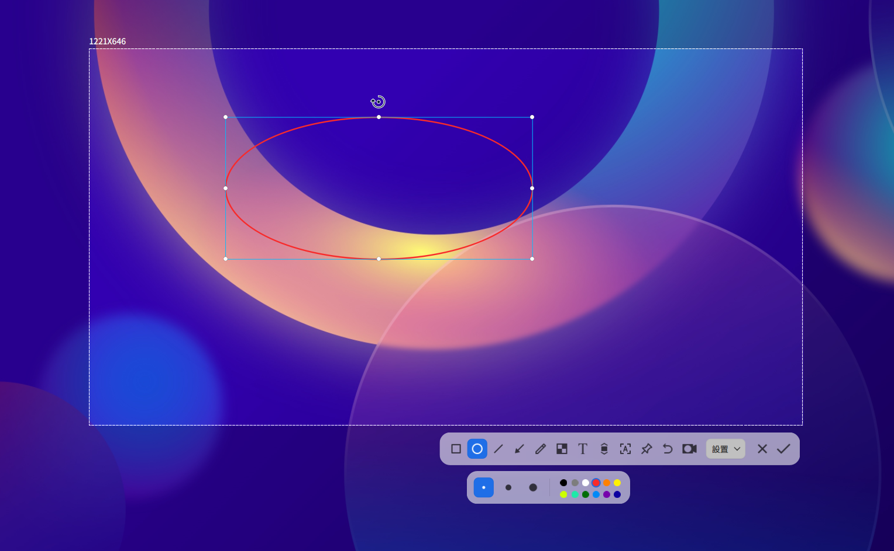
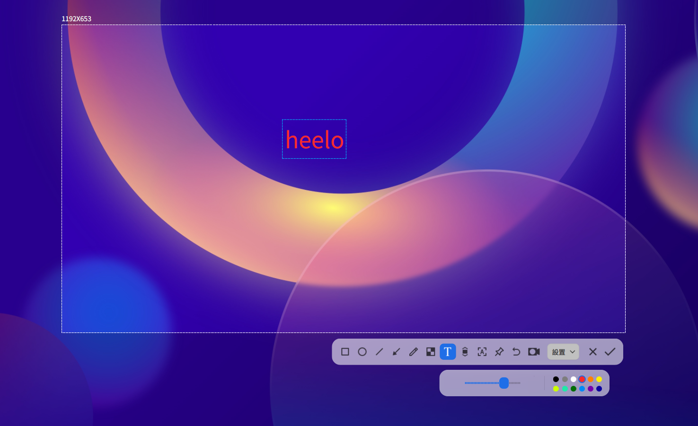

# 截圖錄影 | deepin-screen-recorder|

## 概述

截圖錄影是一款集截圖、螢幕錄影於一體的小工具，支援圖片編輯、貼圖、捲動截圖、文字辨識、螢幕錄影等功能。

## 使用入門

了解如何啟動、關閉截圖錄影，同時建立捷徑。

### 啟動截圖錄影

1. 點選工作列上的啟動器圖示 ，進入啟動器介面。
2. 滾動滑鼠滾輪或搜尋找到截圖錄影圖示 ，點選啟動。
3. 右鍵點選 ，您可以：
   - 點選 **傳送到桌面**，在桌面建立捷徑。
   - 點選 **傳送到工作列**，將應用程式釘選到工作列。
   - 點選 **開機自動啟動**，將應用程式加入開機啟動項目，電腦開機時自動執行。

> 秘訣：在工作列系統匣區域，點選圖示  也可啟動應用程式。

### 關閉截圖錄影

- 截圖或錄影結束後自動關閉。
- 在應用程式介面點選  關閉。
- 截圖模式下右鍵點選，選擇 **儲存** 或 **結束**。

### 快速鍵

使用 **Ctrl + Shift + ?** 開啟快速鍵預覽介面。熟練使用可提升操作效率。

## 選取與調整區域

### 選取截圖錄影區域

支援全螢幕、應用程式視窗及自訂區域選取。選取區域會高亮顯示並有白色虛線邊框。

>  說明：多螢幕環境下可擷取不同螢幕區域。

#### 全螢幕模式
自動偵測目前顯示器全螢幕。

&nbsp;&nbsp;&nbsp;&nbsp;&nbsp;&nbsp;&nbsp;&nbsp;&nbsp;&nbsp;&nbsp;&nbsp;&nbsp;

選取步驟：
1. 使用快速鍵 **Ctrl + Alt + A** (截圖) 或 **Ctrl + Alt + R** (錄影)。
2. 移動滑鼠至桌面自動選取全螢幕，左上角顯示尺寸。
3. 左鍵點選桌面顯示工具列。

直接擷取方式：
- 工作列釘選時：右鍵點選圖示  選 **全螢幕截圖**。
- 按下鍵盤  鍵。

#### 視窗模式
自動偵測開啟的應用視窗。

&nbsp;&nbsp;&nbsp;&nbsp;&nbsp;&nbsp;&nbsp;&nbsp;&nbsp;&nbsp;&nbsp;&nbsp;&nbsp;

1. 使用快速鍵 **Ctrl + Alt + A** 或 **Ctrl + Alt + R**。
2. 滑鼠懸停視窗自動選取。
3. 左鍵點選視窗顯示工具列。

#### 自訂區域
自由選取任意範圍。

&nbsp;&nbsp;&nbsp;&nbsp;&nbsp;&nbsp;&nbsp;&nbsp;&nbsp;&nbsp;&nbsp;&nbsp;&nbsp;

1. 使用快速鍵 **Ctrl + Alt + A** 或 **Ctrl + Alt + R**。
2. 按住左鍵拖曳選取區域，左上角即時顯示尺寸。
3. 放開左鍵確認區域，顯示工具列。

### 調整截圖錄影區域
可微調區域大小或位置。

#### 調整大小
- 拖曳白色邊框 (游標變 )。
- 按 **Ctrl** + / 垂直調整，**Ctrl** + / 水平調整。

&nbsp;&nbsp;&nbsp;&nbsp;&nbsp;&nbsp;&nbsp;&nbsp;&nbsp;&nbsp;&nbsp;&nbsp;&nbsp;

#### 移動位置
- 游標為  時拖曳區域。
- 使用方向鍵 (/ 等) 微調。

## 截圖功能
截圖模式下使用工具列繪圖、新增文字、辨識文字等。

<table class="block1">
    <caption>工具列說明</caption>
    <tbody>
        <tr>
            <td></td>
            <td>矩形工具</td>
            <td></td>
            <td>橢圓工具</td>
             <td></td>
            <td>直線工具</td>
        </tr>
        <tr>
             <td></td>
            <td>箭頭工具</td>
            <td></td>
            <td>畫筆工具</td>
            <td></td>
            <td>模糊工具</td>
        </tr>
        <tr>
            <td></td>
            <td>文字工具</td>
            <td></td>
            <td>捲動截圖</td>
             <td></td>
            <td>辨識文字</td>
        </tr>
        <tr>
             <td></td>
            <td>貼圖</td>
            <td></td>
            <td>結束截圖</td>
        </tr>
    </tbody>
</table>

>  說明：若已設定線條粗細、字型大小等，應用程式會保存設定，下次啟動時自動套用，您也可重新設定。

### 繪製圖形
按住 **Shift** 拖曳可繪製標準圖形（正方形/圓形/水平垂直線）。

#### 矩形工具

&nbsp;&nbsp;&nbsp;&nbsp;&nbsp;&nbsp;&nbsp;&nbsp;&nbsp;&nbsp;&nbsp;&nbsp;&nbsp;

1. 點選 。
2. 選擇邊線粗細/顏色（多色可選）。
3. 游標變 。
4. 按住左鍵拖曳繪製。

#### 橢圓工具

&nbsp;&nbsp;&nbsp;&nbsp;&nbsp;&nbsp;&nbsp;&nbsp;&nbsp;&nbsp;&nbsp;&nbsp;&nbsp;

1. 點選 。
2. 選擇邊線粗細/顏色。
3. 游標變 。
4. 按住左鍵拖曳繪製。

#### 直線與箭頭工具

&nbsp;&nbsp;&nbsp;&nbsp;&nbsp;&nbsp;&nbsp;&nbsp;&nbsp;&nbsp;&nbsp;&nbsp;&nbsp;

1. 點選  或 。
2. 選擇線條粗細/顏色。
3. 游標變  或 。
4. 按住左鍵拖曳繪製。

#### 畫筆工具

&nbsp;&nbsp;&nbsp;&nbsp;&nbsp;&nbsp;&nbsp;&nbsp;&nbsp;&nbsp;&nbsp;&nbsp;&nbsp;

1. 點選 。
2. 選擇筆觸粗細/顏色。
3. 游標變 。
4. 按住左鍵拖曳繪製。

#### 模糊工具

&nbsp;&nbsp;&nbsp;&nbsp;&nbsp;&nbsp;&nbsp;&nbsp;&nbsp;&nbsp;&nbsp;&nbsp;&nbsp;

1. 點選 。
2. 選擇樣式： 或 。
3. 選擇模式： (矩形選取)、 (橢圓選取)、 (自由繪製)。
4. 拖曳滑桿調整強度。

### 修改圖形
編輯或移動已繪製圖形。

#### 移動圖形
1. 游標移至圖形邊線變 。
2. 按住左鍵拖曳移動。

#### 編輯圖形
1. 游標移至圖形邊線變 。
2. 點選進入編輯模式：
   - 按 **Delete** 刪除
   - 游標變  時拖曳調整大小
   - 拖曳  手柄 (游標變 ) 旋轉
3. 編輯框外點選結束編輯。

### 新增文字註解
為截圖新增說明文字。

&nbsp;&nbsp;&nbsp;&nbsp;&nbsp;&nbsp;&nbsp;&nbsp;&nbsp;&nbsp;&nbsp;&nbsp;&nbsp;

1. 點選 。
2. 選擇字型大小/顏色（4色可選）。
3. 游標變 。
4. 點選要註解位置，出現文字框。
5. 輸入文字。

### 修改文字註解
編輯或移動現有文字註解。

#### 移動文字
1. 游標移至文字變 。
2. 按住左鍵拖曳移動。

#### 編輯文字
1. 游標移至文字變 。
2. 雙擊進入編輯模式：
   - 按 **Delete** 刪除
   - 直接修改文字內容
3. 文字框外點選結束編輯。

### 貼圖 | pinscreenshots
將截圖固定為桌面浮動視窗，方便對照參考。

選取區域後點選 ，圖片將浮於桌面：
- 拖曳移動位置
- 滾動滑鼠滾輪縮放
- 點選  儲存

### 捲動截圖 | scrollshot
擷取超出螢幕的長內容（如網頁）。

**前提**：啟用 **控制中心 > 個人化 > 視窗特效**。

1. 選取區域後點選 。
2. 保持游標在捲動區域內，可混合使用：
   - **自動捲動**：左鍵點選開始/暫停自動捲動
   - **手動捲動**：使用滑鼠滾輪控制
3. 點選  儲存長圖。

**注意事項**：
- 避免選取整個視窗/全螢幕
- 區域高度建議 ≥50px
- 避免區域內含多個捲動元件
- 減少重複內容（空白/純色/相同文字）
- 避免包含 GIF/影片/浮水印
- 垂直捲動，勿拖動捲軸
- 截圖期間勿切換視窗
- 捲動速度適中

### 辨識文字
擷取圖片中的文字。

1. 選取區域後點選 ，彈出辨識視窗。
2. 可編輯、複製或另存為 TXT。

### 延遲截圖
延遲指定時間後擷取畫面。

- 快速鍵：**Ctrl** + 
- 終端指令：`deepin-screen-recorder -d n`（`n` 為延遲秒數）

### 儲存截圖
預設儲存至 **圖片 > Screenshots**。成功時桌面顯示通知（點選 **檢視** 開啟資料夾）。

儲存方式：
- 雙擊左鍵
- 點選 
- 快速鍵：**Ctrl + S**
- 右鍵選單 > **儲存**

**選項選單** ()：

- **剪貼簿**：複製到剪貼簿
- **桌面**：儲存至桌面
- **圖片**：儲存至預設資料夾
- **指定位置**：自訂儲存路徑
- **顯示游標**：截圖包含游標
- **格式**：PNG/JPG/BMP

## 螢幕錄影
錄製螢幕活動，支援音訊、鏡頭、按鍵顯示等。

>  功能依硬體/編碼支援而定。

<table class="block1">
    <caption>工具列說明</caption>
    <tbody>
        <tr>
            <td></td>
            <td>顯示按鍵</td>
            <td></td>
            <td>開啟鏡頭</td>
            <td></td>
            <td>切換截圖</td>
        </tr>
          <tr>
            <td></td>
            <td>結束錄影</td>
              <td></td>
            <td>開始錄影</td>
        </tr>
    </tbody>
</table>

### 錄影設定
- **顯示按鍵**： 最多同時顯示5個按鍵操作
- **開啟鏡頭**： 同時錄製螢幕與鏡頭畫面（可拖曳調整位置）
  
  >  請確認裝置支援音訊/鏡頭錄製
- **選項**：設定格式 (GIF/MP4/MKV)、影格率、音訊錄製、游標顯示等
  
  >  MIPS架構不支援GIF

### 開始錄影
1. 按 **Ctrl + Alt + R**
2. 選取錄影區域
3. 設定選項
4. 點選 ，3秒倒數後開始錄影，系統匣圖示  閃爍
5. 結束錄影方式：
   - **Ctrl + Alt + R**
   - 點選工作列圖示
   - 點選系統匣圖示

錄影完成後影片自動儲存至桌面。

>  
> - 工作列位於頂部/底部時，系統匣圖示顯示錄影時間
> - 多螢幕環境下僅錄製目前操作螢幕

## 檢視說明手冊
使用時按下 **F1** 開啟說明手冊。