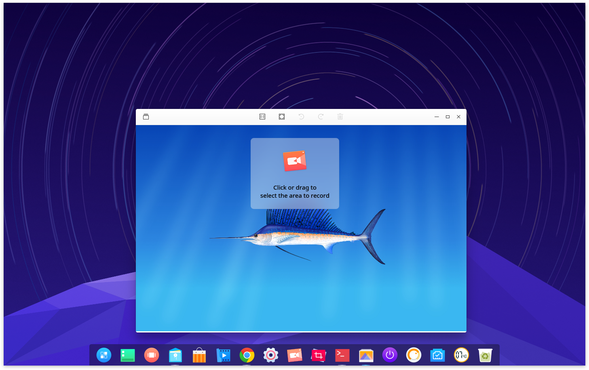
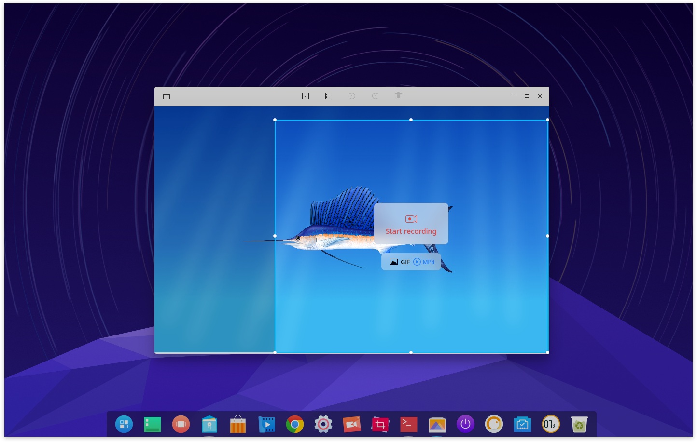
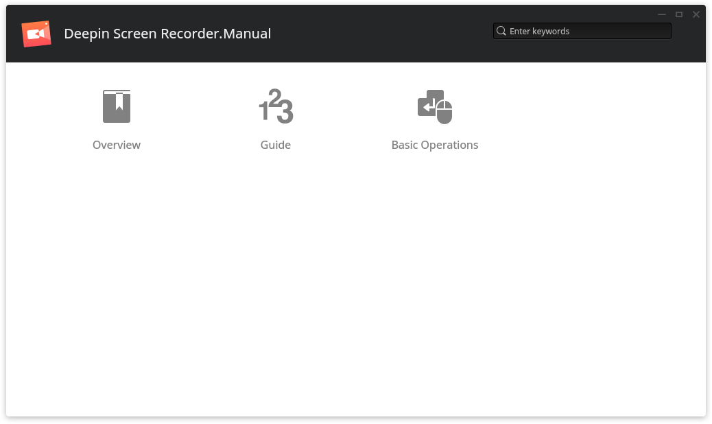

# Deepin Screen Recorder|../common/deepin-screen-recorder.svg|

## Overview|../common/icon_overview.svg|

Deepin Screen Recorder is a screen recording tool. It supports to save the recorded screen in GIF and mp4. Recording window can be automatically selected, and you can also manually select the area to record. To save files on desktop, just control the starting and ending.

## Guide|../common/icon_guide.svg|

You can run and colse Deepin Screen Recorder by one of the following operations, and can also create shortcut for it.

### Run Deepin Screen Recorder

1. Click on  on Dock or move the mouse pointer to the top left corner of screen to enter launcher interface.
2. Find  to click on, you can:

 - Click on **Send to desktop** to create a desktop shortcut.
 - Click on **Send to dock** to fix it on Dock.
 - Click on **Add to startup** to add it to startup, it will automatically run when the system starts up.

> ：If Deepin Screen Recorder has been fixed on Dock by default, you can also click on  to run.

### Close Deepin Screen Recorder

Deepin Screen Recorder will quit after the recording ended.

## Basic Operations|../common/icon_commoncoperat.svg|

### Record Video

You can customize the recording area and select the recording format before recording.

1. Select the recording area after running Deepin Screen Recorder.
2. Select a recording format.
3. Click on **Start recording** to record.
4. Click the icon of Deepin Screen Recorder on Dock to end.

> ：The video will be saved automatically on desktop after ending.

### Select Recording Area

After running Deepin Screen Recorder, you can select the recording area, namely fullscreenm, automatically identifying window and customizing window.

-Fullscreenm and automatically identifying window: When selecting a recording area,window on desktop can be automatically identified following the movement of your mouse, then click to select the cunrrent window for recording. Since, desktop is also a window, when the mouse pointer is on the desktop, it will be identified as fullscreen recording.

-Customizing window: When selecting a recording area, you can use the mouse to select any area and then adjust the rectangle box location and size, finally click to select the current window for recording.

### Select Recording Format

Videos in GIF and MP4 can be recorded by Deepin Screen Recorder. After selecting the recording area, you can select GIF or MP4 to record.

### View Help

Pres  to view the manual after starting Deepin Screen Recorder.

