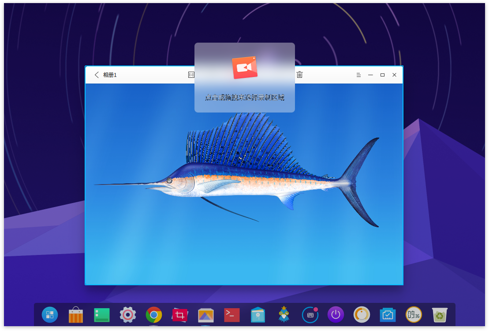
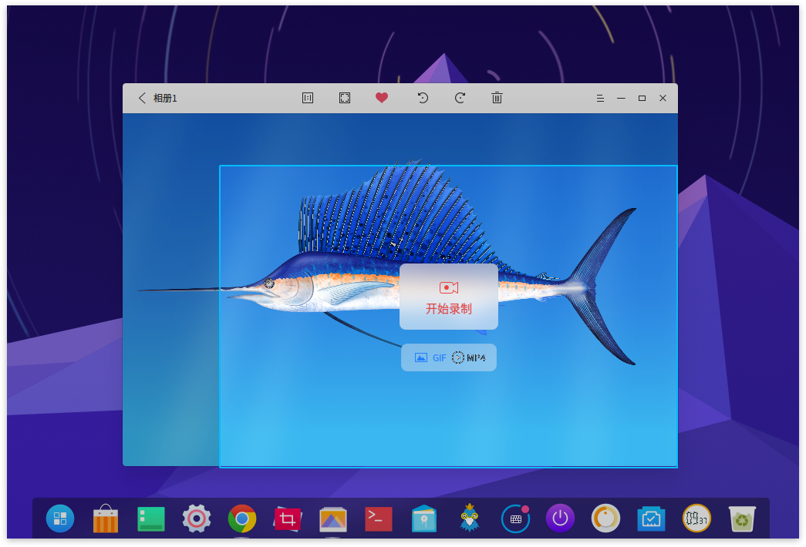
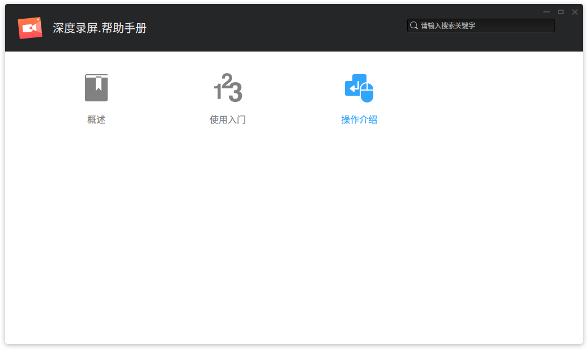

# 深度录屏|../common/deepin-screen-recorder.svg|

## 概述|../common/icon_overview.svg|

深度录屏是一款屏幕录制工具，支持将录屏保存为gif和mp4格式，可以自动选定录制窗口，也可手动选择录制区域，只需控制录制的开始和结束即可，文件会自动保存到桌面上。

## 使用入门|../common/icon_guide.svg|

您可以通过以下方式运行、关闭深度录屏，同时还可以创建快捷方式。

### 运行深度录屏

1. 点击桌面底部的 启动器  或将鼠标指针移到屏幕左上角，进入启动器界面。
2. 上下滚动鼠标滚轮，通过浏览找到  进行点击运行。
3. 将鼠标指针置于深度录屏应用程序的图标上，右键点击图标，您可以：

- 点击 发送到桌面，在桌面创建快捷方式。
- 点击 发送到任务栏，将应用程序固定到任务栏。
- 点击 开机自动启动，将应用程序添加到开机启动项，在电脑开机时自动运行该应用程序。

> ：如果深度录屏已经默认固定在任务栏上，您也可以点击任务栏上的 来运行。

### 关闭深度录屏

深度录屏会在录制结束后自动退出。

## 操作介绍|../common/icon_commoncoperat.svg|

### 录制视频

深度录屏可以自定义录制区域，还可以选择录制格式，基本操作步骤如下：

1. 启动深度录屏后开始选择录制区域。
2. 选择录制格式。
3. 点击 **开始录制**。
4. 录制完成后点击dock栏上的图标结束录制。
5. 结束后视频将自动保存到桌面。

### 选择录制区域

深度录屏启动后直接开始选择录制区域，可以选择全屏、自动识别窗口和自定义窗口。

-全屏和自动识别窗口：在选择录制区域时，随着鼠标移动，深度录屏会自动识别桌面上的窗口，被识别的窗口上会出现一个矩形选择框，单击鼠标就可以选中当前窗口录制。由于整个桌面也可以算作一个窗口，所以当鼠标位于桌面背景上的时候，应用会识别成全屏录制。

-自定义窗口：在选择录制区域时，可以使用鼠标圈选任意区域，被圈选的区域上显示矩形选择框，此时您还可以拖动选择框内部和边缘来调整选择框的位置和大小，然后再单击鼠标选择当前窗口录制。

### 选择录制格式

深度录屏可以录制GIF和MP4格式的视频，在选择好录制区域后，开始录制按钮下方还有GIF和MP4两个选择按钮，如果默认选择的录制格式不是您想要的，请更改录制格式之后再开始录制。

### 查看帮助手册

启动深度录屏后按下键盘上的  键即可打开帮助手册。

